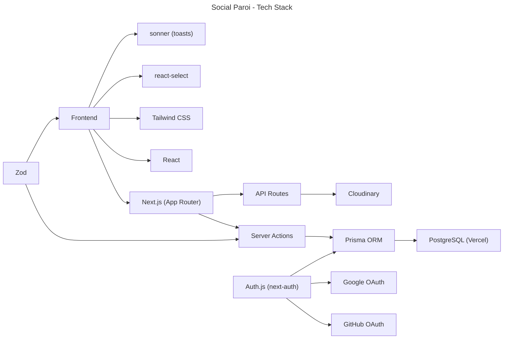
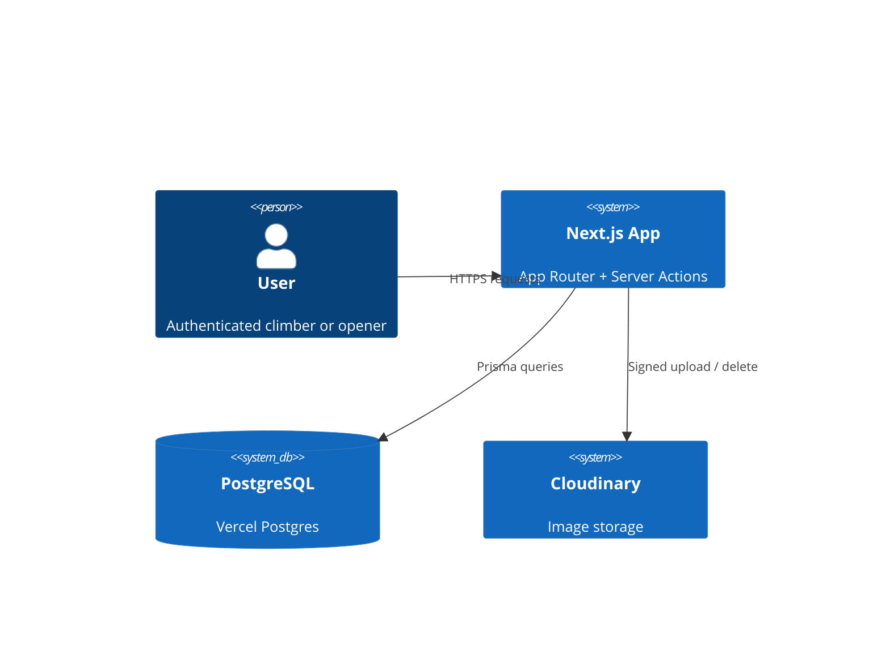
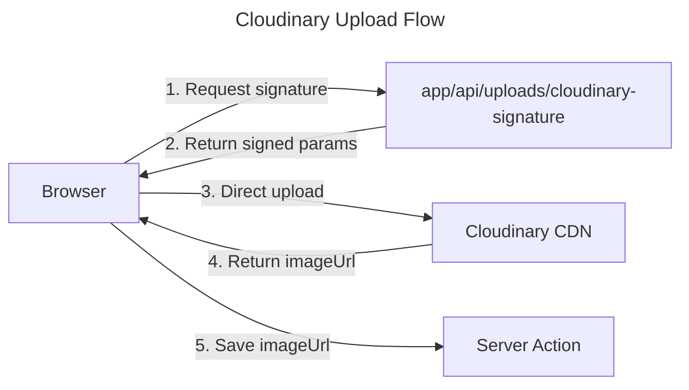
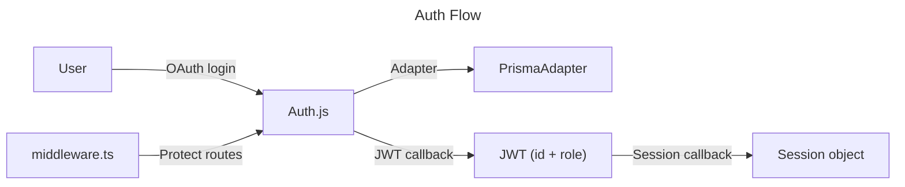

# Architecture

## Language/Framework

```json
@package.json
```



### Naming Conventions

- **Files**: kebab-case for pages/routes, PascalCase for components and schema files
- **Components**: PascalCase (`TrackCard.tsx`)
- **Functions**: camelCase
- **Variables**: camelCase
- **Constants**: UPPER_CASE for enums
- **Types/Interfaces**: PascalCase, Zod schemas suffixed `.schema.ts`, enums suffixed `.enum.ts`

### Role System

- **Global roles** (`UserRole`): `user`, `opener`, `admin`, `super_admin` — stored on the `User` model, carried in JWT
- **Location roles** (`LocationRole`): `opener`, `admin` — stored in `UserLocationRole`, scoped per location
- `isOpener()` / `isAdmin()` in `session.utils.ts` — client-side UI guards only (show/hide buttons), also return true for `super_admin`
- `checkUserLocationRole(userId, locationId, minRole)` — DB-backed server-side auth for all mutation actions; `super_admin` always passes; `admin` satisfies `opener` checks
- `isSuperAdmin()` — checks global `super_admin` role from session

### Prisma Column Naming

- All camelCase field names use `@map(name: "snake_case")` — DB columns are always snake_case
- Applies to every multi-word field: FKs, timestamps, any camelCase name
- Table names use `@@map("snake_case")` — reference model: `UserTrackProgress`
- Raw SQL in migrations must use the `@map` value, never the Prisma field name

## Services communication

### Client → Server flow



### External Services

#### Cloudinary



#### Auth.js


