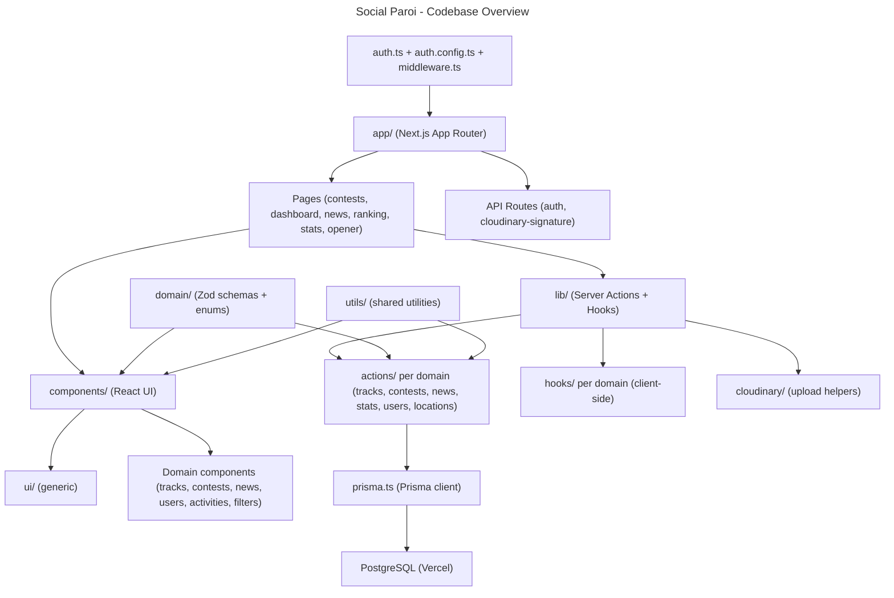

# Codebase Structure

```mermaid
---
title: Social Paroi - Codebase Overview
---
flowchart TD
    AppRouter["app/ (Next.js App Router)"] --> Pages["Pages (contests, dashboard, news, ranking, stats, opener)"]
    AppRouter --> APIRoutes["API Routes (auth, cloudinary-signature)"]
    Pages --> Components["components/ (React UI)"]
    Components --> UILib["ui/ (generic)"]
    Components --> DomainComponents["Domain components (tracks, contests, news, users, activities, filters)"]
    Pages --> LibLayer["lib/ (Server Actions + Hooks)"]
    LibLayer --> Actions["actions/ per domain (tracks, contests, news, stats, users, locations)"]
    LibLayer --> Hooks["hooks/ per domain (client-side)"]
    LibLayer --> CloudinaryLib["cloudinary/ (upload helpers)"]
    Actions --> PrismaClient["prisma.ts (Prisma client)"]
    PrismaClient --> DB["PostgreSQL (Vercel)"]
    Domain["domain/ (Zod schemas + enums)"] --> Actions
    Domain --> Components
    Utils["utils/ (shared utilities)"] --> Actions
    Utils --> Components
    Auth["auth.ts + auth.config.ts + middleware.ts"] --> AppRouter
```
