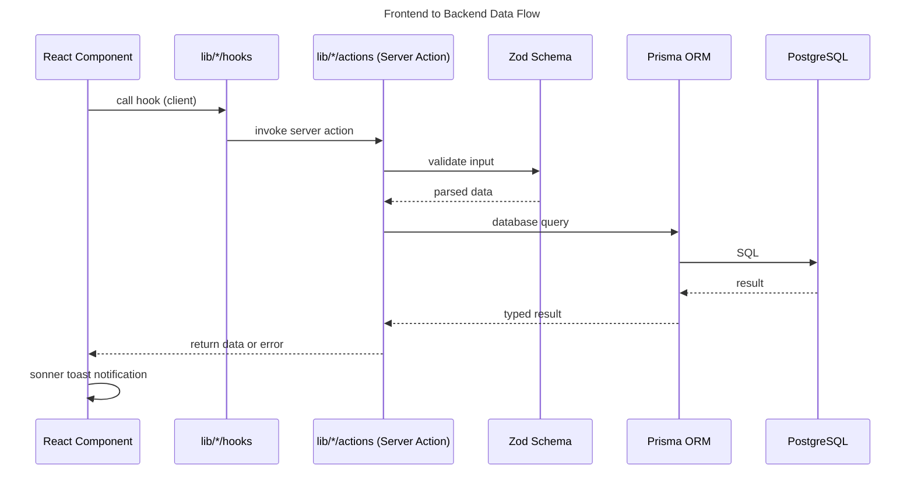

# Communication between backend and frontend

## Overview

- **Services**: Server Actions in `lib/*/actions/`, API Routes in `app/api/`
- **Request Types**: Server Actions (mutations/fetches), GET/POST for API routes
- **Entities**: Zod schemas in `/domain/`
- **Data Flow**: Component → Server Action → Zod validate → Prisma → PostgreSQL
- **Error Handling**: Centralized via `utils/logger.ts`, user feedback via sonner toasts
- **Validation**: Zod schemas at Server Action boundary

### Data Flow

