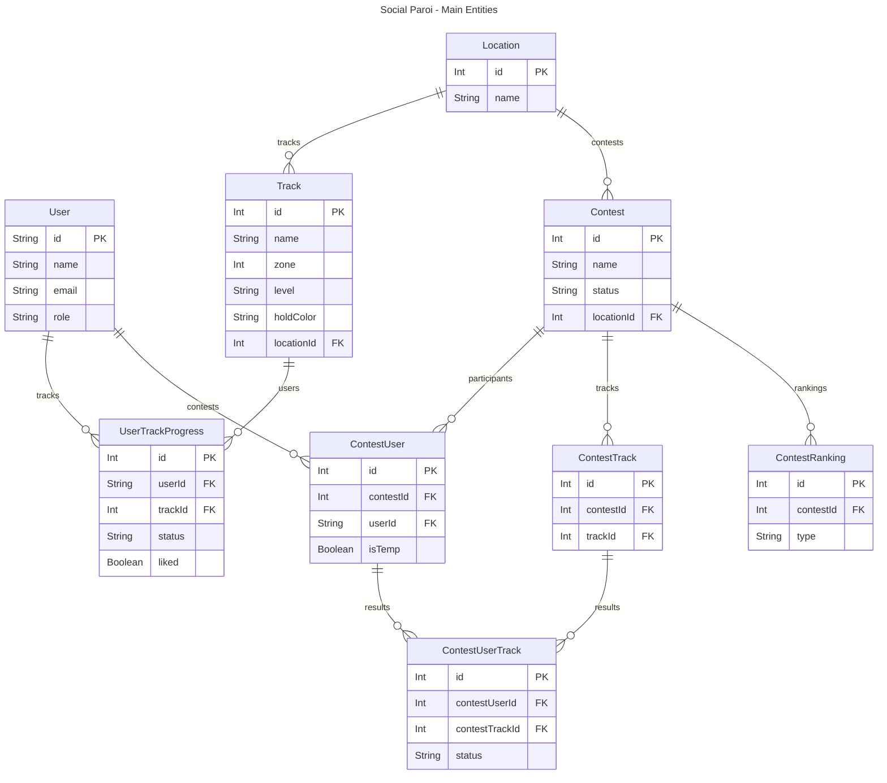

# Database

```json
@prisma/schema.prisma
```

## Main entities and relationships



## Prisma Client Usage

- Singleton exported from `prisma.ts` at project root — always `import prisma from '@/prisma'`
- Never use `new PrismaClient()` in action files (causes N connections per call)
- Always use `@prisma/client` (standard) — never `@prisma/client/edge` in server actions (edge client is for Vercel Edge Runtime only)
- When `PrismaClient` is needed as a structural type (e.g. `Omit<PrismaClient, ...>`), use `import type { PrismaClient } from '@prisma/client'`
- See DEC-001 and DEC-002 in `aidd_docs/internal/ADR.md`

## Migrations

- Prisma Migrate — `npx prisma migrate dev` (local), `npx prisma migrate deploy` (prod)

## Seeding

- Init SQL: `database/social-paroi-init-db.sql`
