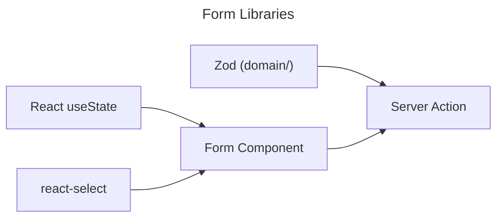
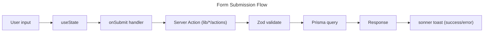

# Forms

## State Management

- Local React state (`useState`) for all form fields
- No global form state management
- react-select for enhanced dropdown/multi-select inputs

## Validation

- Zod schemas in `/domain/` — validated server-side in Server Actions
- No client-side pre-validation library

## Error handling

- Server Action returns error → sonner toast with error message
- Success → sonner toast with success message

## Form Flow

