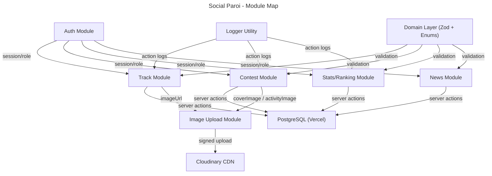
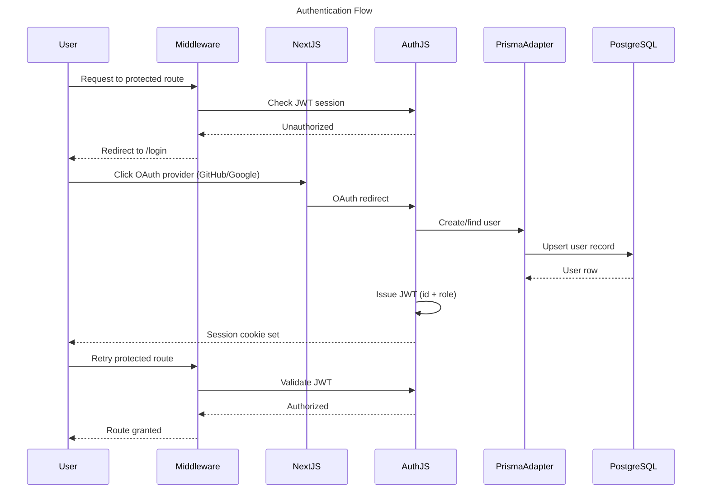
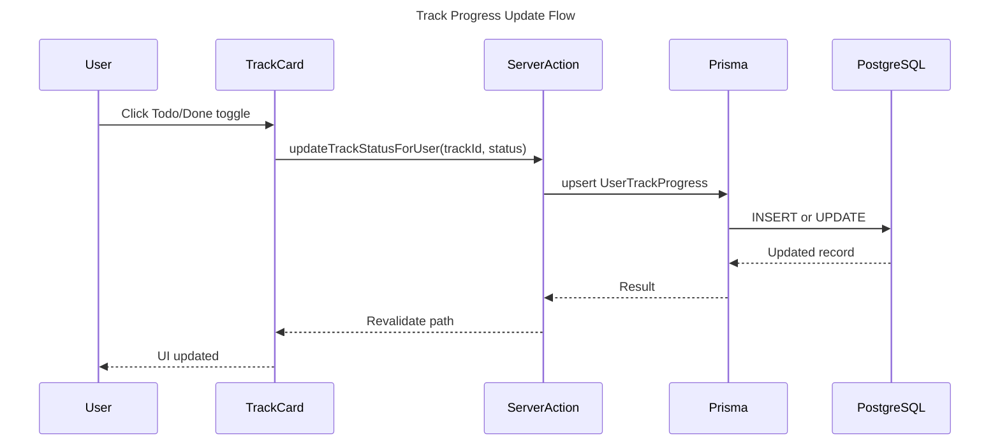
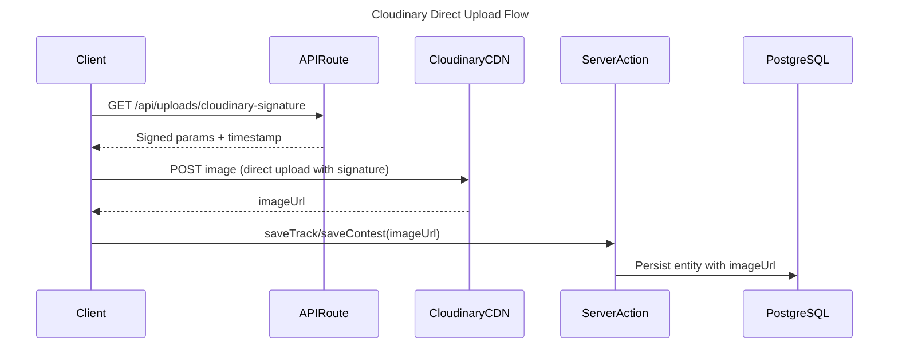
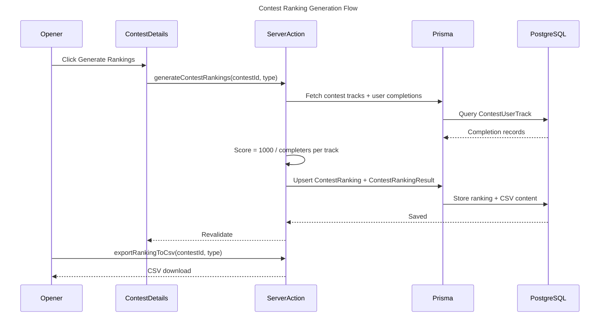

# System Overview - Social Paroi

## Tech Stack

| Layer | Technology | Version | Confidence |
|---|---|---|---|
| Framework | Next.js (App Router) | 14.1.0 | Verified |
| Language | TypeScript | ^5 | Verified |
| UI Library | React | ^18 | Verified |
| Styling | Tailwind CSS | ^3.3.0 | Verified |
| ORM | Prisma | ^5.10.2 | Verified |
| Database | PostgreSQL | Vercel Postgres | Verified |
| Auth | Auth.js (next-auth v5 beta) | ^5.0.0-beta.13 | Verified |
| Validation | Zod | ^3.22.4 | Verified |
| Image CDN | Cloudinary | ^2.1.0 | Verified |
| Toasts | Sonner | ^1.7.1 | Verified |
| Select UI | react-select | ^5.8.0 | Verified |
| Markdown | react-markdown | ^9.0.1 | Verified |
| Hosting | Vercel | — | Verified |

Infrastructure: Single Vercel deployment, PostgreSQL on Vercel Postgres (pooling + direct URL), images on Cloudinary CDN.

## Main Modules

| Module | Path | Responsibility | Confidence |
|---|---|---|---|
| Track | `lib/tracks/`, `components/tracks/`, `app/dashboard/` | CRUD on climbing routes, progress tracking, filtering by difficulty/zone/color | Verified |
| Contest | `lib/contests/`, `components/contests/`, `app/contests/` | Contest lifecycle (Created→Active→Finished), participants, track scoring, ranking generation, CSV export | Verified |
| Stats/Ranking | `lib/stats/`, `components/users/`, `app/stats/`, `app/ranking/` | Per-user stats by difficulty, global leaderboard by points | Verified |
| News | `lib/news/`, `components/news/`, `app/news/` | Markdown news posts authored by admins | Verified |
| Auth | `auth.ts`, `auth.config.ts`, `middleware.ts` | OAuth login (GitHub/Google), JWT session with role, route protection | Verified |
| Image Upload | `lib/cloudinary/`, `app/api/uploads/cloudinary-signature/`, `utils/clientUpload.ts` | Signed direct upload from client to Cloudinary CDN | Verified |
| Domain | `domain/` | Zod schemas + enums shared between server and client | Verified |
| Opener | `app/opener/` | Restricted entry point for track creation by openers | Verified |
| Logger | `utils/logger.ts` | Centralized structured action logging via console | Verified |
| Location | `prisma/schema.prisma` (Location model) | Climbing area grouping tracks (gym/outdoor) | Probable — model exists but no dedicated management UI found |

## Critical Flows

### Authentication Flow

### Track Progress Update

### Image Upload Flow

### Contest Ranking Generation

## Dependencies

### Internal

| Module | Depends On | Coupling |
|---|---|---|
| Track | Domain (Track.schema, Difficulty.enum, HoldColor.enum), Logger, ImageUpload | Medium |
| Contest | Domain (Contest.schema, ContestStatus.enum, ContestRankingType.enum), Track (search), Logger, ImageUpload | High |
| Stats/Ranking | Domain (TrackStats.schema), Track (data), Logger | Medium |
| News | Domain (News.schema), Logger | Low |
| Auth | Prisma (PrismaAdapter), Domain (UserRole.enum) | Medium |
| ImageUpload | Cloudinary SDK, API route for signature | Low |
| All server actions | Prisma client (`prisma.ts`), Auth session utils | High |

### External

| Service | Version | Purpose | Alternative |
|---|---|---|---|
| Next.js | 14.1.0 | Full-stack framework, App Router, Server Actions | Remix, SvelteKit |
| Auth.js (next-auth) | 5.0.0-beta.13 | OAuth authentication, session management | Lucia, Clerk |
| Prisma ORM | 5.10.2 | Type-safe DB queries, migrations | Drizzle ORM |
| Vercel Postgres | — | Managed PostgreSQL with connection pooling | Supabase, Neon |
| Cloudinary | 2.1.0 | Image storage and CDN delivery | AWS S3 + CloudFront |
| Zod | 3.22.4 | Schema validation (server + client) | Yup, Valibot |
| Tailwind CSS | 3.3.0 | Utility-first CSS | CSS Modules |
| react-select | 5.8.0 | Searchable dropdowns | Downshift |
| @prisma/extension-accelerate | 1.0.0 | Prisma query caching (in package.json) | — |

## Pain Points

| # | Severity | Pain Point | Business Impact | Affected Modules |
|---|---|---|---|---|
| 1 | High | Auth.js v5 is still in beta (`beta.13`) in production | Auth breakage risk on upstream changes, no stable API guarantee | Auth |
| 2 | High | No automated tests (no test files found) | Regressions undetected before deployment, CI is just lint + type-check | All |
| 3 | Medium | `@prisma/extension-accelerate` in `package.json` but not wired in `prisma.ts` | Dead dependency adds noise, Accelerate caching benefit is lost | Track, Contest, Stats |
| 4 | Medium | Contest rankings stored as raw CSV text in `ContestRanking.csvContent` (DB Text field) | Not queryable for aggregations; re-exporting requires regeneration | Contest |
| 5 | Medium | `Location` model in schema but no management UI routes found | Openers cannot create/edit locations without direct DB access | Track, Opener |
| 6 | Medium | `Authenticator` model in schema (passkeys) but no UI or flows | Schema dead weight; passkey feature is incomplete | Auth |
| 7 | Low | Logging is `console.log` only — no external sink (Sentry, Datadog, etc.) | Production errors invisible unless Vercel logs are actively monitored | All server actions |
| 8 | Low | Production URL not documented anywhere in the project | Onboarding friction; deployment context lost | Deployment |

## Known Limitations

- No automated test suite — no unit, integration, or e2e tests exist
- No role management UI — user roles (`user`, `opener`, `admin`) must be set directly in the database
- No multi-location track management UI — `Location` model exists in schema but cannot be managed through the app
- Passkey/WebAuthn support is partially modeled (`Authenticator` table) but not implemented in the UI
- Contest ranking CSV is stored as plain text in DB — no historical diff or incremental updates
- No offline support or PWA capabilities
- No push/email notifications for contest updates or news
- Single OAuth provider set (GitHub + Google only) — no username/password auth
- Production URL not documented in the repository

## Key Metrics

| Metric | Value | Source | Confidence |
|---|---|---|---|
| DB models | 14 models (User, Track, UserTrackProgress, Contest, ContestTrack, ContestUser, ContestUserTrack, ContestActivity, ContestUserActivity, ContestRanking, ContestRankingResult, News, Location, Account/Session/Authenticator/VerificationToken) | prisma/schema.prisma | Verified |
| Pages (App Router routes) | 8 routes (/, /login, /dashboard, /news, /opener, /contests, /ranking, /stats, /privacy) | app/ directory | Verified |
| Server actions | ~35 actions across 5 domains | lib/*/actions/ | Verified |
| Client hooks | ~18 hooks across 5 domains | lib/*/hooks/ | Verified |
| API routes | 2 (auth, cloudinary-signature) | app/api/ | Verified |
| Performance targets | Not defined | — | Uncertain |
| Uptime SLA | Not defined | — | Uncertain |
| Active users | Unknown | — | Uncertain |
