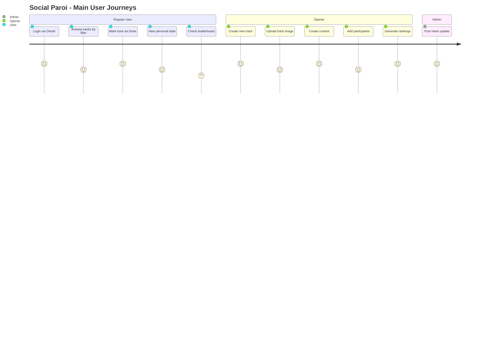

# PROJECT_BRIEF.md

## Executive Summary

- **Project Name**: Social Paroi
- **Vision**: A social sports tracking platform for outdoor climbing enthusiasts
- **Mission**: Enable climbers to track their progress, compete in contests, and connect with the community

### Full Description

Social Paroi is a fullstack web application for tracking climbing track completion. Users log progress on outdoor climbing routes (tracks), compete in organized contests, and view leaderboards and personal statistics.

## Context

### Core Domain

Outdoor climbing route tracking and social competition. Tracks (routes) are physical climbing lines on a wall or crag. Users mark tracks as Todo or Done, earn points dynamically, and compete in timed contests organized by openers (route setters).

### Ubiquitous Language

| Term | Definition | Synonymes |
| -------- | -------------- | ----------- |
| Track | A physical climbing route on a wall | Route, Problem |
| Opener | A route setter who creates and manages tracks | Setter |
| Contest | A timed competition on a set of tracks with participants | Competition |
| UserTrackProgress | A user's status on a specific track (Todo/Done/Liked) | Progress |
| Location | A climbing area grouping multiple tracks | Sector, Zone |
| ContestUser | A participant in a contest (can be real or temporary) | Participant |
| ContestActivity | A non-track activity in a contest scored separately | Activity |
| Ranking | A generated leaderboard for a contest (men/women/overall) | Leaderboard |

## Features & Use-cases

- **Track browsing**: View all tracks filtered by difficulty, zone, status, color
- **Track progress**: Mark tracks as Todo or Done, like tracks
- **Statistics**: View personal progress breakdown by difficulty
- **Leaderboard**: Global ranking of users by completed track points
- **Contest management**: Openers create contests with tracks, participants, activities
- **Contest scoring**: Points = 1000 ÷ (number of completers per track)
- **Contest ranking**: Generate men/women/overall rankings with CSV export
- **News**: Admins post news updates
- **Auth**: Login via GitHub or Google OAuth

## User Journey maps

### Regular User

- Authenticated climber
- Goals: track personal progress, compete, compare with others
- Actions: browse tracks, mark progress, view stats and rankings

### Opener

- Route setter with elevated permissions
- Goals: manage tracks and organize competitions
- Actions: create/edit tracks, create contests, manage contest participants and activities, generate rankings

### Admin

- Platform administrator
- Goals: manage content and users
- Actions: post news, manage user roles
