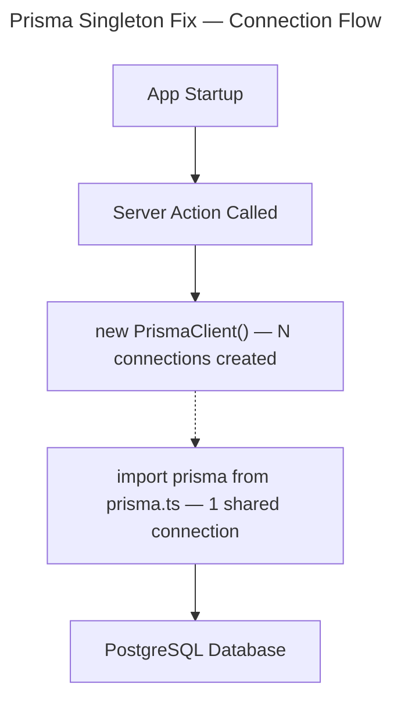

# Instruction: Fix Prisma singleton

## Feature

- **Summary**: Replace all direct `new PrismaClient()` instantiations across action files with the shared singleton exported from `prisma.ts`, preventing N database connections on each server action call. Also corrects incorrect use of `@prisma/client/edge` in non-edge Node.js server actions.
- **Stack**: `Next.js 14`, `Prisma 5.10`, `TypeScript`
- **Branch name**: `fix/prisma-singleton`
- **Parent Plan**: `none`
- **Sequence**: `standalone`
- Confidence: 9/10
- Time to implement: ~30 min

## Progress

- [ ] Step 0: Clarification — confirm edge→standard client switch is intentional
- [ ] Step 1: Validate `prisma.ts` singleton
- [ ] Step 2: Update all lib action files (29 files)
- [ ] Step 3: Update `auth.ts`

## Existing files

- @prisma.ts
- @auth.ts
- @lib/users/actions/getAllUsersWithContests.ts
- @lib/tracks/actions/searchTrack.ts
- @lib/tracks/actions/updateTrackStatusForUser.ts
- @lib/tracks/actions/searchContestTrack.ts
- @lib/tracks/actions/postTrack.ts
- @lib/tracks/actions/mountOrUnmountTrack.ts
- @lib/tracks/actions/getTrackDetails.ts
- @lib/tracks/actions/deleteTrack.ts
- @lib/stats/actions/getUserStats.ts
- @lib/stats/actions/getUserRanking.ts
- @lib/news/actions/postNews.ts
- @lib/news/actions/getNews.ts
- @lib/news/actions/deleteNews.ts
- @lib/contests/actions/updateContestTrackStatus.ts
- @lib/contests/actions/updateActivityScoreForUser.ts
- @lib/contests/actions/removeTrackFromContest.ts
- @lib/contests/actions/removeContestUser.ts
- @lib/contests/actions/removeActivity.ts
- @lib/contests/actions/postContest.ts
- @lib/contests/actions/postActivityToContest.ts
- @lib/contests/actions/getContestUserDetails.ts
- @lib/contests/actions/getContestDetails.ts
- @lib/contests/actions/getAllContests.ts
- @lib/contests/actions/generateContestRankings.ts
- @lib/contests/actions/exportRankingToCsv.ts
- @lib/contests/actions/changeContestStatus.ts
- @lib/contests/actions/deleteContest.ts
- @lib/contests/actions/addTrackToContest.ts
- @lib/contests/actions/addContestUser.ts

### New file to create

- none

## User Journey

## Implementation phases

### Phase 1 — Validate prisma.ts singleton

> Confirm `prisma.ts` uses `@prisma/client` (standard, not edge) and exports a proper dev-safe singleton.

1. Read `prisma.ts` and confirm it uses `global.prisma` guard for hot-reload safety in dev
2. Confirm it exports `default prisma` — this is the import target for all action files
3. No changes needed if already correct (current file is already valid)

### Phase 2 — Update all lib action files (29 files)

> Remove `@prisma/client/edge` import + `new PrismaClient()` local instance, replace with singleton import.

For each file in `lib/**/actions/*.ts`:

1. Remove: `import { PrismaClient } from '@prisma/client/edge'`
   - Also covers the single file using `@prisma/client` (non-edge): `updateContestTrackStatus.ts`
2. Remove: `const prisma = new PrismaClient()`
3. Add: `import prisma from '@/prisma'`
4. No other changes — `prisma` variable name is already consistent across all files

### Phase 3 — Update auth.ts

> Replace local PrismaClient instance with singleton for PrismaAdapter.

1. Remove: `import { PrismaClient } from '@prisma/client/edge'`
2. Remove: `const prisma = new PrismaClient()`
3. Add: `import prisma from '@/prisma'`
4. Verify `PrismaAdapter(prisma)` still works with standard client (it does — adapter has no edge requirement)

## Validation flow

1. Run `npx tsc --noEmit` — no TypeScript errors
2. Run `npm run build` — build succeeds (`prisma generate && next build`)
3. Start dev server and trigger a server action (e.g., load tracks list) — no connection errors in logs
4. Confirm only one Prisma instance is created on startup (no repeated "New engine started" logs)
