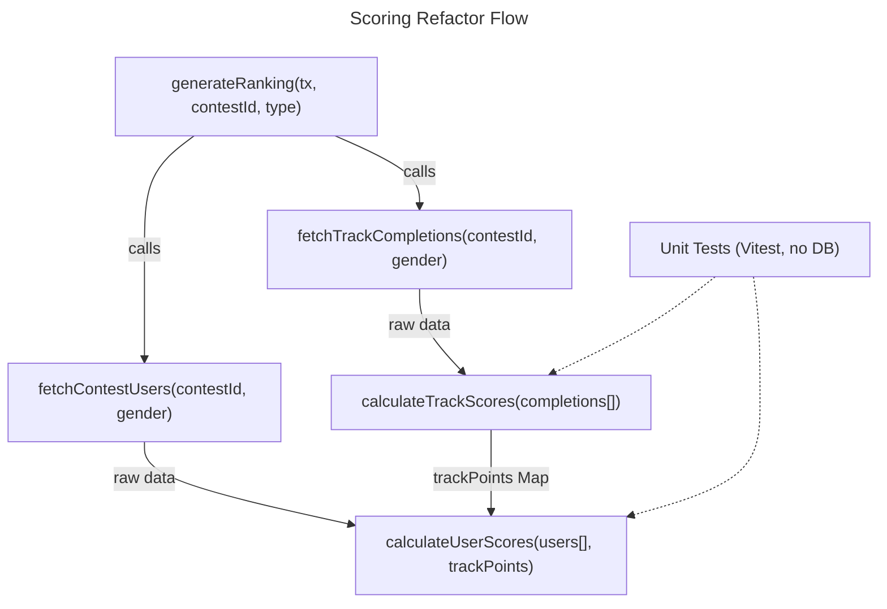

# Instruction: Make contest scoring testable without DB

## Feature

- **Summary**: Decouple Prisma data fetching from scoring logic in `generateContestRankings.ts` by extracting two fetch functions and making `calculateTrackScores` / `calculateUserScores` pure. Write Vitest unit tests on the pure functions only.
- **Stack**: `Next.js 15`, `TypeScript`, `Prisma`, `Vitest`
- **Branch name**: `refactor/scoring-pure-functions`
- **Parent Plan**: `none`
- **Sequence**: `standalone`
- Confidence: 9/10
- Time to implement: ~2h

## Progress

- [ ] Step 0: Clarification
- [ ] Step 1: Install and configure Vitest
- [ ] Step 2: Extract fetch functions from calculateTrackScores and calculateUserScores
- [ ] Step 3: Refactor calculateTrackScores and calculateUserScores to pure functions
- [ ] Step 4: Write unit tests on pure functions

## Existing files

- @lib/contests/actions/generateContestRankings.ts
- @package.json

### New files to create

- `vitest.config.ts`
- `lib/contests/actions/generateContestRankings.test.ts`

## User Journey

## Implementation phases

### Phase 1: Setup Vitest

> Install Vitest and create minimal configuration to enable unit testing without Next.js runtime.

1. Install `vitest` and `@vitest/coverage-v8` as devDependencies
2. Create `vitest.config.ts` at project root with `environment: 'node'` and path alias for `@/`
3. Add `"test": "vitest run"` script to `package.json`

### Phase 2: Extract fetch functions

> Separate Prisma data-fetching from scoring logic — each function has one responsibility.

1. In `generateContestRankings.ts`, extract the Prisma `groupBy` query from `calculateTrackScores` into a new async function `fetchTrackCompletions(contestId: number, gender?: string)` returning the raw groupBy result array
2. Extract the Prisma `findMany` query from `calculateUserScores` into a new async function `fetchContestUsers(contestId: number, gender?: string)` returning the raw user array with all includes
3. Keep both new functions in the same file (no new file needed — they are internal helpers)

### Phase 3: Refactor to pure functions

> Remove all Prisma dependencies from the two scoring functions so they only receive and transform data.

1. Change `calculateTrackScores` signature to `calculateTrackScores(completions: Awaited<ReturnType<typeof fetchTrackCompletions>>): Map<number, number>` — remove `async`, no Prisma call inside
2. Change `calculateUserScores` signature to `calculateUserScores(users: Awaited<ReturnType<typeof fetchContestUsers>>, trackPoints: Map<number, number>): UserScore[]` — remove `async`, no Prisma call inside
3. Update `generateRanking` to call the fetch functions first, then pass results to the pure functions
4. Verify `generateCsvContent` is unaffected (it still receives `userScores` and `trackPoints` as before)

### Phase 4: Unit tests

> Cover the pure scoring logic with focused tests — no mocking of Prisma, no DB connection needed.

1. Create `lib/contests/actions/generateContestRankings.test.ts`
2. Export `calculateTrackScores` and `calculateUserScores` (add named exports or use a separate barrel if needed)
3. Write tests for `calculateTrackScores`:
   - Empty completions → empty map
   - Single completion → `POINTS_PER_TRACK / count`
   - Multiple completions with different counts → correct points per track
4. Write tests for `calculateUserScores`:
   - User with no completed tracks → `trackScore = 0`
   - User with one completed track → correct score from `trackPoints` map
   - User with activity results → `activityScore` correctly summed
   - Fallback: track not in `trackPoints` map → defaults to `POINTS_PER_TRACK`

## Validation flow

1. Run `npm test` — all unit tests pass with no database connection
2. Run `npm run build` — TypeScript compiles without errors
3. Manually trigger `generateContestRankings` on a real contest — rankings are identical to pre-refactor output
