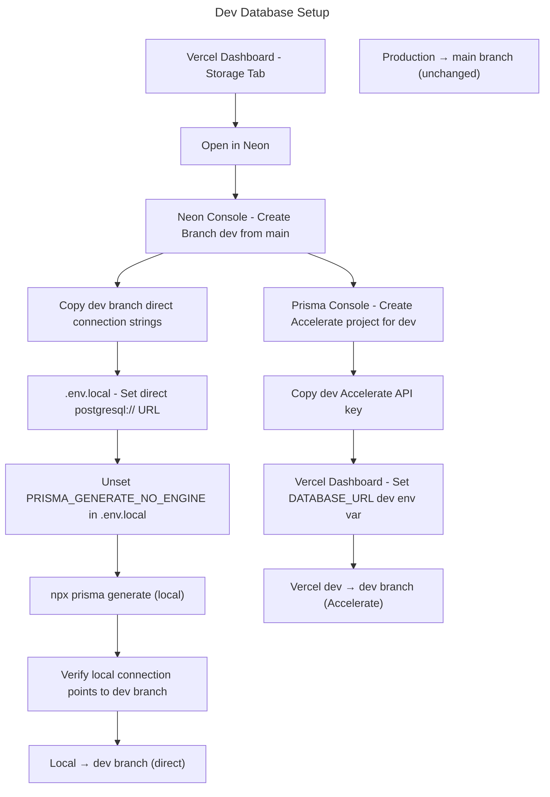

# Instruction: Separate Dev and Production Database

## Feature

- **Summary**: Create an isolated `dev` Neon branch from production, configure it with its own Prisma Accelerate project for Vercel dev deployments, and access it directly (no Accelerate) for local development. Production stays untouched.
- **Stack**: `Neon Postgres (Vercel-managed)`, `Prisma Accelerate`, `Prisma 5.10.2`, `Next.js`
- **Branch name**: `infra/dev-database`
- **Parent Plan**: `none`
- **Sequence**: `standalone`
- Confidence: 9/10
- Time to implement: ~45 min (manual steps, no code changes)

## Existing files

- @prisma/schema.prisma
- @.env example
- @aidd_docs/internal/decisions/DEC-004-shared-dev-prod-database.md
- @.claude/rules/00-architecture/database-safety.md

### New file to create

- none (`.env.local` and Vercel env vars are updated, not created)

## Context: Database Stack

Target architecture with 3 environments, 2 Neon branches, 2 Accelerate projects:

| Environment | Neon branch | Accelerate | `DATABASE_URL` |
|---|---|---|---|
| Production (Vercel) | `main` | yes — prod key | `prisma://accelerate...?api_key=PROD` |
| Dev deployed (Vercel) | `dev` | yes — dev key | `prisma://accelerate...?api_key=DEV` |
| Local (`.env.local`) | `dev` | no — direct | `postgresql://...` (dev branch) |

- Single `dev` branch shared between Vercel-dev and local — same data, different access method
- `PRISMA_GENERATE_NO_ENGINE`: `true` on Vercel (both envs), absent/empty in `.env.local`
- **Neon Free plan**: supports up to 10 branches — branching is free

### Prisma engine compatibility

The Prisma client is generated in two modes — they are **not interchangeable at runtime**:

| Client generated with | Compatible URL | Incompatible URL |
|---|---|---|
| `PRISMA_GENERATE_NO_ENGINE=true` | `prisma://accelerate...` | `postgres://` ❌ |
| _(flag absent)_ | `postgres://` | — |

Switching `DATABASE_URL` from `prisma://` to `postgres://` **without regenerating** the client causes a silent connection failure (Prisma error P2021 — table not found, misleading). The fix is always to regenerate after changing the flag.

> ⚠️ Steps 2 and 3 of Phase 2 must be done **together**: unset the flag → regenerate → then switch the URL. Never change the URL alone.

## User Journey



## Implementation phases

### Phase 0 — Create dev branch in Neon (~5 min)

> Instant copy-on-write branch of production — schema + data included, no dump/restore needed.

1. Go to **Vercel Dashboard → Storage tab** → click your Postgres database
2. Click **"Open in Neon"** (top-right) — opens the Neon Console
3. In Neon Console → **Branches** (left sidebar) → **"New Branch"**
   - Name: `dev`
   - Parent: `main`
   - Point-in-time: latest
4. On the `dev` branch page → **"Connect"** → copy and save:
   - Pooled connection string → will be used as Accelerate input + local `POSTGRES_URL`
   - Direct (unpooled) connection string → local `POSTGRES_URL_NON_POOLING`
   - Host, User, Password, Database → local `POSTGRES_*` vars

> The branch is a copy-on-write snapshot of `main` — all production data is instantly available. Any change on `dev` never touches `main`.

### Phase 1 — Create Prisma Accelerate project for dev (~10 min)

> Vercel dev deployments must be iso-prod: same Accelerate proxy layer, pointing to the `dev` branch instead of `main`.

1. Go to [console.prisma.io](https://console.prisma.io) → **New project**
2. Name it `social-paroi-dev`
3. When asked for the database connection string → paste the `dev` branch **direct** connection string from Phase 0
4. Copy the generated API key → format: `prisma://accelerate.prisma-data.net/?api_key=DEV_KEY`
5. In **Vercel Dashboard → Project Settings → Environment Variables**:
   - Find `DATABASE_URL` — edit it
   - Set value to `prisma://accelerate.prisma-data.net/?api_key=DEV_KEY`
   - Set environment scope to **Development only** (uncheck Production and Preview)
   - Confirm Production `DATABASE_URL` still has the prod Accelerate key

### Phase 2 — Configure `.env.local` for local dev (~5 min)

> Local dev accesses the `dev` branch directly — no Accelerate needed, no engine flag.
> ⚠️ Do NOT change `DATABASE_URL` before step 3 (regenerate). Changing the URL alone breaks the app silently.

**Step 1** — In `.env.local`, clear the engine flag and set the new URLs:

```env
# Dev branch — Neon (direct access, no Accelerate)
DATABASE_URL="<dev-pooled-string>"
POSTGRES_URL_NON_POOLING="<dev-direct-string>"

# Must be empty — only valid with Prisma Accelerate
PRISMA_GENERATE_NO_ENGINE=""
```

Keep all other vars unchanged (`AUTH_*`, `CLOUDINARY_*`, etc.).

**Step 2** — Regenerate the Prisma client immediately (see Phase 3 — do not skip).

### Phase 3 — Rebuild Prisma client locally (~2 min)

> Must run right after clearing `PRISMA_GENERATE_NO_ENGINE`. The current client has no engine binary — it cannot talk to a direct `postgres://` URL until regenerated.

1. Run: `npx prisma generate`
2. Confirm output shows engine files generated (no skip warning)
3. Only then start `npm run dev`

### Phase 4 — Validate local connection (~3 min)

1. Run: `echo "SELECT current_database();" | npx prisma db execute --stdin --schema=prisma/schema.prisma`
2. Confirm output shows the `dev` branch database name, not prod
3. Run `npm run dev` — no DB connection errors in console

### Phase 5 — Update DEC-004 and database-safety rule (~5 min)

1. Update `aidd_docs/internal/decisions/DEC-004-shared-dev-prod-database.md`:
   - Status: `Superseded`
   - Document the new 3-env / 2-branch architecture
2. Update `.claude/rules/00-architecture/database-safety.md`:
   - Remove the "shared DB" critical constraint
   - Add: local dev → `dev` Neon branch (direct), Vercel dev → `dev` branch (Accelerate), production → `main` branch (Accelerate)
   - Keep: no destructive operations without confirmation

## Validation flow

1. Neon Console → Branches: confirm `dev` branch exists with its own compute endpoint
2. Prisma Console → confirm `social-paroi-dev` Accelerate project points to dev branch
3. Vercel Dashboard → Environment Variables: confirm `DATABASE_URL` is scoped correctly (prod key on Production, dev key on Development)
4. Locally: `npm run dev` → create a test record in the app
5. Neon Console → `dev` branch data: confirm the record appears
6. Neon Console → `main` branch data: confirm production is unaffected

## Risks & Confidence

**Confidence: 9/10**

- ✅ Neon Free plan: 10 branches — no cost
- ✅ Branch is instant copy-on-write — no data migration needed
- ✅ Prisma schema.prisma requires no changes
- ✅ Production Vercel env untouched — only Development env var changes
- ❌ Two Accelerate projects to manage — remember to use the right key per env
- ❌ `PRISMA_GENERATE_NO_ENGINE` must be empty in `.env.local` — if left as `true`, switching to `postgres://` causes P2021 (table not found), a misleading error that hides the real cause (no engine binary)
- ❌ Never change `DATABASE_URL` from `prisma://` to `postgres://` without immediately running `npx prisma generate` — client and URL must always be in sync
- ❌ `dev` branch data drifts from prod over time — acceptable, rebranch from `main` whenever a reset is needed
