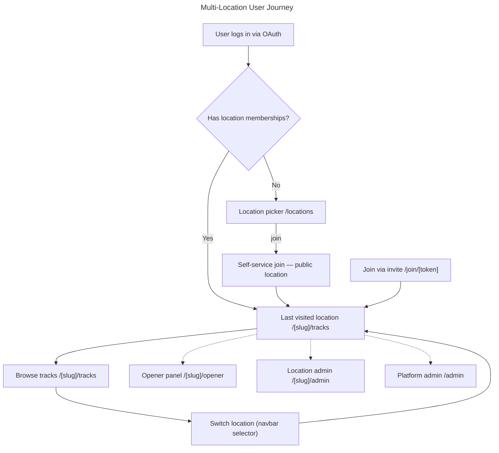

# Instruction: Multi-Location Support

## Feature

- **Summary**: Transform Social Paroi from a single-gym app into a multi-location platform where each climbing gym is an isolated tenant with its own tracks, contests, rankings, news, difficulty system, zones, and admin. Users can belong to multiple locations and switch between them via URL-based routing (`/[locationSlug]/...`). Zones are first-class DB entities per location — named, ordered, image-backed — replacing the hardcoded `Track.zone Int` field.
- **Stack**: `Next.js 15`, `TypeScript`, `Prisma 6`, `PostgreSQL`, `Auth.js 5`, `Tailwind CSS`, `Zod`
- **Branch name**: `feature/multi-location`
- **Parent Plan**: `none`
- **Sequence**: `standalone`
- Confidence: 8/10
- Time to implement: ~7-9 days

## Child Plans

| # | Plan | Risk | File |
|---|------|------|------|
| 1 | Schema Foundation | Safe | `2026_04_12-multi-location-part-1.md` |
| 2 | Data Migration | Safe (`@default(1)` guardrail) | `2026_04_12-multi-location-part-2.md` |
| 3 | Location-Scoped Business Logic | Safe | `2026_04_12-multi-location-part-3.md` |
| 4 | URL Routing Refactor | **⚠️ BREAKING** | `2026_04_12-multi-location-part-4.md` |
| 5 | Admin, Difficulty & Zone Config | Safe | `2026_04_12-multi-location-part-5.md` |
| 6 | Navigation, UX & Zone Finalization | Safe (except `Track.zone` drop) | `2026_04_12-multi-location-part-6.md` |

> Zone feature is distributed across Parts 1–3, 5–6. No separate child plan — zone work slots into the existing sequence naturally.

## Production Risk Summary

| Phase | Risk | Reason |
|---|---|---|
| Part 1 | Safe | Additive schema only — `Zone` model + `Track.zoneId Int?` nullable FK, no existing columns touched |
| Part 2 | Safe | `@default(1)` guardrail + Zone rows seeded + `Track.zoneId` backfilled from `Track.zone` |
| Part 3 | Safe | Server action logic changes (zone → zoneId), all URLs remain unchanged |
| Part 4 | ⚠️ Breaking | All `/dashboard`, `/contests`, `/news`, `/ranking`, `/stats`, `/opener` URLs change — deploy with redirects, requires `slug` populated on all locations first |
| Part 5 | Safe | New admin pages only + Track.level FK (carefully ordered) + Zone config tab |
| Part 6 | Safe except column drop | Zone UX updates + `Track.zone Int` column drop at end (requires all code refs removed first) |

## Constraint: Shared Dev/Prod Database

All Prisma migrations run against the shared database. Rules:
- Never drop or rename a column without first removing all code references in the same deploy
- Never add a NOT NULL column without a `@default(...)` or a pre-baked SQL UPDATE in the migration
- Part 4 must be deployed as one atomic push: slug must be set on location 1 before the new routes go live

## User Journey

## Validation flow (end-to-end)

1. Super admin creates a second location with status `hidden`
2. Location admin configures difficulty levels for location 2
3. Invite link sent to beta tester — they join via `/join/[token]` instantly
4. Opener creates tracks at location 2 — not visible to location 1 users
5. Regular user joins location 1 self-service from picker
6. User marks tracks as done — stats and ranking show per-location
7. User switches to location 2 — sees separate tracks, stats, ranking
8. Super admin publishes location 2 — appears in public picker
9. All existing location 1 data unchanged throughout
