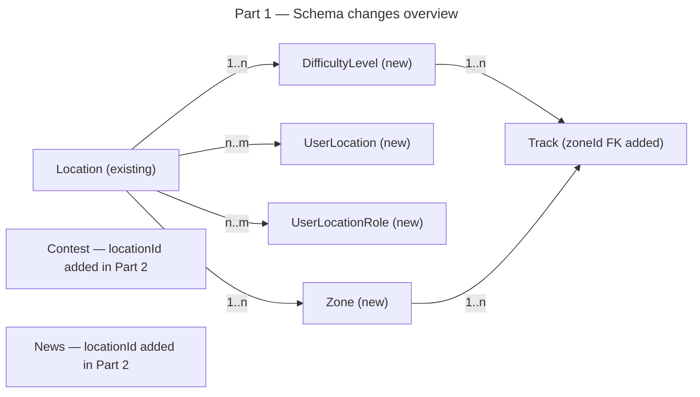

# Instruction: Multi-Location — Part 1: Schema Foundation

## Feature

- **Summary**: Add all new Prisma models and fields required for multi-location support, including the `Zone` entity that replaces the raw `Track.zone Int` field. All changes are purely additive — no existing columns modified or dropped. Old code continues to work unchanged after this migration.
- **Stack**: `Prisma 6`, `PostgreSQL`, `TypeScript`
- **Branch name**: `feature/multi-location`
- **Parent Plan**: `2026_04_12-multi-location-master.md`
- **Sequence**: `1 of 6`
- Confidence: 9/10
- Time to implement: ~1.5h

## Production safety

Safe — adds new tables and nullable columns only. Old code ignores new columns.

## Existing files

- @prisma/schema.prisma

### New files to create

- None (migration files auto-generated by Prisma)

## User Journey

## Implementation phases

### Phase 1: Modify Location model

> Add slug, status, and inviteToken fields to the existing Location model.

1. Add `slug String @unique` to `Location` — URL-safe identifier (e.g. `gym-alpinisme`)
2. Add `status String @default("published")` to `Location` — values: `"hidden"` | `"published"`
3. Add `inviteToken String? @unique` to `Location` — nullable, set when location needs private early-access

### Phase 2: Add DifficultyLevel model

> New table for per-location ordered difficulty levels, replacing the global level enum on Track.

1. Add `DifficultyLevel` model with fields: `id`, `locationId`, `name` (String), `color` (String?), `order` (Int), timestamps
2. Add `@@unique([locationId, order])` — prevents duplicate ordering per location
3. Add `@@map("difficulty_levels")`
4. Add relation back on `Location`: `difficultyLevels DifficultyLevel[]`
5. Add nullable `difficultyLevelId Int?` to `Track` — FK to `DifficultyLevel` (existing `level String?` kept for now, removed in Part 5)
6. Add relation on `Track`: `difficultyLevel DifficultyLevel? @relation(...)`

### Phase 3: Add UserLocation membership model

> New join table tracking which users belong to which locations.

1. Add `UserLocation` model with fields: `id`, `userId`, `locationId`, `joinedAt DateTime @default(now())`
2. Add `@@unique([userId, locationId])` — a user can only join a location once
3. Add `@@map("user_locations")`
4. Add relation on `User`: `locationMemberships UserLocation[]`
5. Add relation on `Location`: `members UserLocation[]`

### Phase 4: Add UserLocationRole model

> New join table for location-scoped roles (opener, admin). Replaces global User.role for location access.

1. Add `UserLocationRole` model with fields: `id`, `userId`, `locationId`, `role String` — values: `"opener"` | `"admin"`
2. Add `@@unique([userId, locationId])` — one role per user per location (exclusive)
3. Add `@@map("user_location_roles")`
4. Add relation on `User`: `locationRoles UserLocationRole[]`
5. Add relation on `Location`: `roles UserLocationRole[]`

### Phase 5: Add Zone model

> New table for per-location named zones with optional mini-map images. Replaces the raw `Track.zone Int` index (removal happens in Part 6 after all code is updated).

1. Add `Zone` model with fields: `id`, `locationId`, `name (String)`, `order (Int)`, `miniMapUrl (String?)`, `createdAt DateTime @default(now())`
2. Add `@@unique([locationId, order])` — prevents duplicate order within a location
3. Add `@@map("zones")`
4. Add constraint check in application layer: max 50 zones per location (enforced in server action, not in schema)
5. Add relation on `Location`: `zones Zone[]`
6. Add nullable `Track.zoneId Int?` — FK to `Zone` (the existing `zone Int` column is kept unchanged until Part 6)
7. Add relation on `Track`: `zoneRef Zone? @relation(fields: [zoneId], references: [id])`
8. Note: `Location.mapImageUrl` already exists in the schema — no new field needed for the main map

### Phase 6: Generate and verify migration

1. Run `prisma migrate dev --name add-multi-location-schema` to generate migration SQL
2. Verify generated SQL: only `CREATE TABLE` and `ALTER TABLE ADD COLUMN` statements — no `DROP` or `ALTER COLUMN`
3. Verify new `zones` table is present in generated SQL with all fields
4. Verify `Track.zoneId` column added as nullable — existing `zone Int` column untouched
5. Verify `prisma generate` succeeds with no TypeScript errors

## Validation flow

1. Run `prisma migrate dev` — migration applies with no errors
2. Run `prisma generate` — client generated without errors
3. Run `npm run build` — TypeScript compiles without errors
4. Verify in DB: new tables `difficulty_levels`, `user_locations`, `user_location_roles` exist
5. Verify existing tables (`tracks`, `contests`, `news`, `users`) are unchanged in structure — `Track.zone Int` column still present
6. Verify `zones` table created with correct columns and unique constraint on `(locationId, order)`
