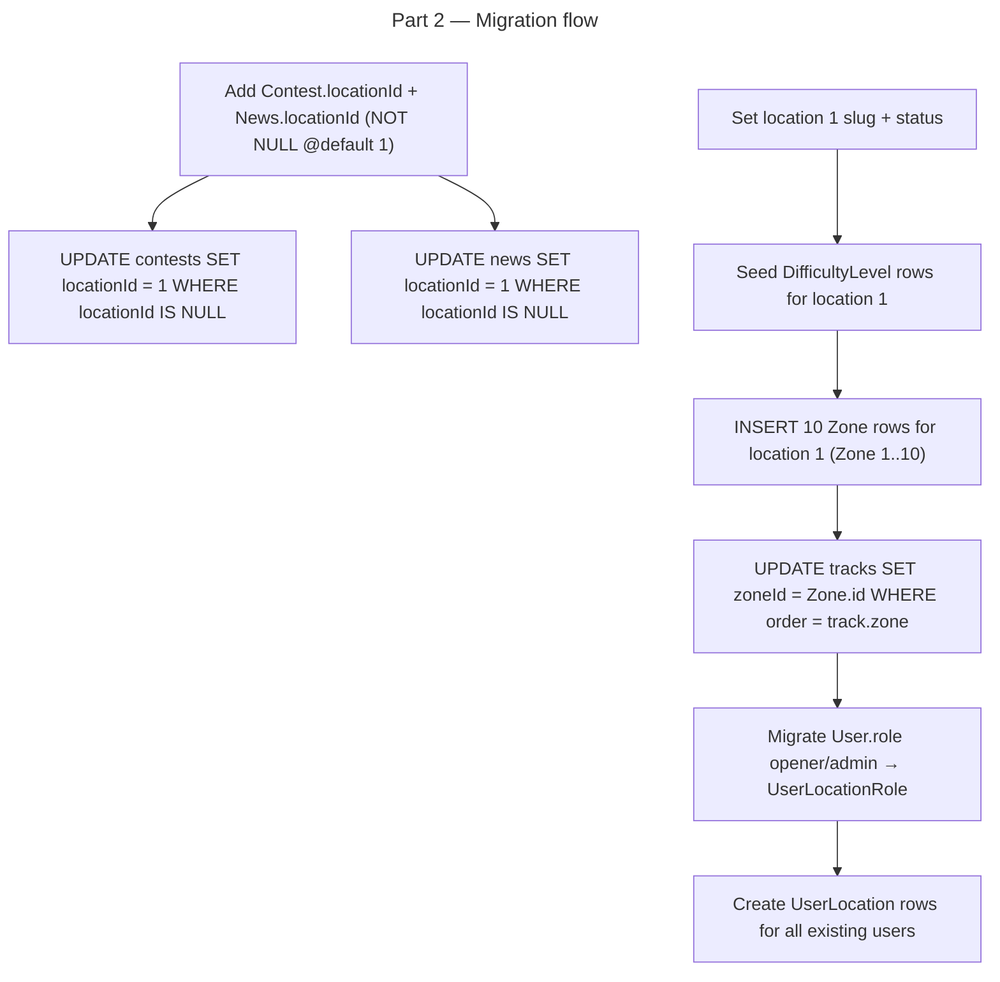

# Instruction: Multi-Location — Part 2: Data Migration

## Feature

- **Summary**: Add `locationId` to `Contest` and `News` with `@default(1)` and `NOT NULL`, backfill all existing rows to location 1, migrate existing `User.role` values into `UserLocationRole`, seed `DifficultyLevel` for location 1, initialize location 1's slug, seed 10 `Zone` rows for location 1, and backfill `Track.zoneId` from the existing `Track.zone Int` values. The `@default(1)` guardrail ensures old code never fails to insert even if deployed before Part 3.
- **Stack**: `Prisma 6`, `PostgreSQL`, `TypeScript`
- **Branch name**: `feature/multi-location`
- **Parent Plan**: `2026_04_12-multi-location-master.md`
- **Sequence**: `2 of 6`
- Confidence: 9/10
- Time to implement: ~2h

## Production safety

Safe. The `@default(1)` on new NOT NULL columns means any existing code path that creates a Contest or News without setting `locationId` will automatically receive `1` from the database. No existing inserts will fail.

## Existing files

- @prisma/schema.prisma
- @prisma/seed.ts (create if not exists)

### New files to create

- `prisma/migrations/[timestamp]_backfill-location-data/migration.sql` (auto-generated + manually edited)

## User Journey



## Implementation phases

### Phase 1: Add locationId to Contest and News

> Add the column with NOT NULL + @default(1) so both old and new code are safe.

1. Add `locationId Int @default(1)` to `Contest` model in `schema.prisma`
2. Add relation: `location Location @relation(fields: [locationId], references: [id])` on Contest
3. Add back-relation `contests Contest[]` on `Location`
4. Add `locationId Int @default(1)` to `News` model in `schema.prisma`
5. Add relation: `location Location @relation(fields: [locationId], references: [id])` on News
6. Add back-relation `news News[]` on `Location`
7. Run `prisma migrate dev --name add-location-id-to-contest-news` — verify generated SQL uses `DEFAULT 1` and NOT NULL

### Phase 2: Initialize location 1 via migration SQL

> Bake all backfills and seeds into the Prisma migration SQL so they run atomically on deploy.

Edit the generated migration SQL file to append (after the ALTER TABLE statements):

1. `UPDATE "locations" SET slug = 'default', status = 'published' WHERE id = 1;`
2. Insert `DifficultyLevel` rows for location 1 with the current level enum values in order:
   - order 1: Unknown (gray)
   - order 2: Beginner (green)
   - order 3: Easy (yellow)
   - order 4: Intermediate (orange)
   - order 5: Advanced (red)
   - order 6: Difficult (purple)
   - order 7: FuckingHard (brown)
   - order 8: Legendary (black)
3. `UPDATE "contests" SET "locationId" = 1 WHERE "locationId" IS NULL OR "locationId" = 0;` (defensive)
4. `UPDATE "news" SET "locationId" = 1 WHERE "locationId" IS NULL OR "locationId" = 0;` (defensive)
5. INSERT 10 Zone rows for location 1 — order 1 through 10, name "Zone N", `miniMapUrl` NULL (admin uploads images later via zone config panel):
   ```sql
   INSERT INTO "zones" ("locationId", "name", "order", "createdAt")
   VALUES (1,'Zone 1',1,NOW()),(1,'Zone 2',2,NOW()),...,(1,'Zone 10',10,NOW());
   ```
6. Backfill `Track.zoneId` from existing `Track.zone` integer values for location 1:
   ```sql
   UPDATE "tracks" t
   SET "zoneId" = z.id
   FROM "zones" z
   WHERE z."locationId" = 1 AND z."order" = t.zone AND t."locationId" = 1;
   ```
   Note: tracks with no location (locationId IS NULL) also reference location 1 zones — include them:
   ```sql
   UPDATE "tracks" t
   SET "zoneId" = z.id
   FROM "zones" z
   WHERE z."locationId" = 1 AND z."order" = t.zone AND (t."locationId" IS NULL OR t."locationId" = 1);
   ```

### Phase 3: Migrate roles and memberships via seed script

> Use a Prisma seed script for data migrations that depend on application logic (safer than raw SQL for relational data).

1. Create or update `prisma/seed.ts`
2. Add logic: for each User where `role = 'opener'` or `role = 'admin'`, create a `UserLocationRole` row with `locationId = 1` and matching role — skip if row already exists (`upsert`)
3. Add logic: create a `UserLocation` row for every existing User with `locationId = 1` — skip if already exists
4. Add `"prisma": { "seed": "ts-node prisma/seed.ts" }` to `package.json` if not present
5. Run `npx prisma db seed` to apply — idempotent, safe to run multiple times

### Phase 4: Verify data integrity

1. Query `SELECT COUNT(*) FROM contests WHERE "locationId" IS NULL` — must return 0
2. Query `SELECT COUNT(*) FROM news WHERE "locationId" IS NULL` — must return 0
3. Query `SELECT COUNT(*) FROM user_location_roles` — must match count of users with role opener or admin
4. Query `SELECT COUNT(*) FROM user_locations` — must match total user count
5. Query `SELECT COUNT(*) FROM difficulty_levels WHERE "locationId" = 1` — must return 8
6. Query `SELECT COUNT(*) FROM zones WHERE "locationId" = 1` — must return 10
7. Query `SELECT COUNT(*) FROM tracks WHERE "zoneId" IS NULL AND ("locationId" = 1 OR "locationId" IS NULL)` — must return 0 (all location 1 tracks backfilled)

## Validation flow

1. Run `prisma migrate dev` — no errors, SQL contains DEFAULT 1
2. Run `npx prisma db seed` — completes without errors
3. Open Prisma Studio or run queries — verify row counts above
4. Run `npm run build` — TypeScript compiles without errors
5. Load `/dashboard` in dev — existing tracks, contests, news still display correctly
6. Verify track zone display unchanged — `Track.zone Int` still drives `Zone.tsx` at this stage (zoneId backfilled but UI not yet switched)
