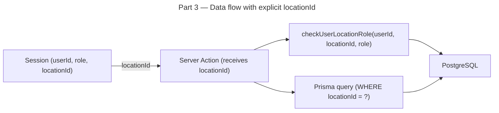

# Instruction: Multi-Location — Part 3: Location-Scoped Business Logic

## Feature

- **Summary**: Remove all hardcoded `locationId: 1` from server actions, propagate `locationId` explicitly through all queries, replace `isOpener()/isAdmin()` checks with `UserLocationRole` lookups, add `super_admin` role, expose location context through the session, and update track search/post actions to use `zoneId` instead of the raw `zone Int`. URLs do not change in this part — the app still routes to `/dashboard`, `/contests`, etc.
- **Stack**: `Next.js 15`, `TypeScript`, `Prisma 6`, `Auth.js 5`, `Zod`
- **Branch name**: `feature/multi-location`
- **Parent Plan**: `2026_04_12-multi-location-master.md`
- **Sequence**: `3 of 6`
- Confidence: 8/10
- Time to implement: ~2h

## Production safety

Safe. URLs unchanged. `@default(1)` on Contest/News ensures inserts without explicit locationId still work during rollout.

## Existing files

- @lib/tracks/actions/searchTrack.ts
- @lib/tracks/actions/searchContestTrack.ts
- @lib/tracks/actions/postTrack.ts
- @lib/stats/actions/getUserStats.ts
- @lib/stats/actions/getUserRanking.ts
- @lib/news/actions/getNews.ts
- @lib/news/actions/postNews.ts
- @lib/news/actions/deleteNews.ts
- @lib/contests/actions/getAllContests.ts
- @lib/contests/actions/postContest.ts
- @utils/session.utils.ts
- @domain/UserRole.enum.ts
- @auth.ts
- @auth.config.ts

### New files to create

- `lib/locations/actions/getLocationBySlug.ts`
- `lib/locations/actions/getUserLocations.ts`
- `lib/locations/actions/checkUserLocationRole.ts`
- `lib/locations/actions/getZonesByLocation.ts`

## User Journey

## Implementation phases

### Phase 1: Update role enum and session utilities

> Extend the role system to support super_admin globally and location-scoped roles.

1. Add `super_admin` to `UserRole` enum in `domain/UserRole.enum.ts`
2. Update `isOpener(session)` in `session.utils.ts` to also return true for `super_admin`
3. Update `isAdmin(session)` to also return true for `super_admin`
4. Add `isSuperAdmin(session)` utility function
5. In `auth.ts` JWT callback, carry `user.role` into the token as before (no breaking change)

### Phase 2: New location action helpers

> Provide reusable server-side functions for location lookups and role authorization.

1. Create `getLocationBySlug(slug: string)` — returns `Location | null` from DB
2. Create `getUserLocations(userId: string)` — returns all `UserLocation` rows with `Location` data for a user
3. Create `checkUserLocationRole(userId: string, locationId: number, minRole: 'opener' | 'admin')` — returns boolean, queries `UserLocationRole`, respects hierarchy (admin satisfies opener check), super_admin always passes
4. Create `getZonesByLocation(locationId: number)` — returns ordered `Zone[]` with `id`, `name`, `order`, `miniMapUrl` for a location; used by filters and track form

### Phase 3: Parameterize track server actions

> Replace hardcoded locationId: 1 with an explicit parameter.

1. `searchTrack.ts` — add `locationId: number` parameter, replace hardcoded `locationId: 1`, remove TODO comment; change zone filter from `zone: { in: filters.zones }` to `zoneId: { in: filters.zones }`; include `zoneRef: { select: { id, name, miniMapUrl } }` in the Prisma select
2. `searchContestTrack.ts` — same locationId and zone filter changes as above
3. `postTrack.ts` — add `locationId: number` parameter, accept `zoneId: number` instead of `zone: number`, write `zoneId` to DB (keep writing `zone` with the same integer value until Part 6 drops the column)
4. `lib/tracks/hooks/usePostTrack.ts` — send `zoneId` instead of `zone` in FormData
5. `domain/Filters.ts` — no rename needed; `zones: number[]` continues to hold zone IDs (semantics shift from raw Int to Zone.id, values remain integers)
6. Update all callers (hooks, components) of these actions to pass `locationId`

### Phase 4: Parameterize stats and ranking actions

> Scope leaderboard and user stats to a specific location.

1. `getUserStats.ts` — add `locationId: number` parameter, replace hardcoded `locationId: 1`, remove TODO comment
2. `getUserRanking.ts` — add `locationId: number` parameter, replace hardcoded `locationId: 1`, remove TODO comment
3. Update all callers to pass `locationId`

### Phase 5: Parameterize news actions

> Scope news queries and mutations to a location.

1. `getNews.ts` — add `locationId: number` filter to `findMany`
2. `postNews.ts` — add `locationId: number` parameter, pass to `create`, use `checkUserLocationRole`
3. `deleteNews.ts` — use `checkUserLocationRole` instead of `isOpener`
4. Update all callers

### Phase 6: Parameterize contest actions

> Scope contest listing and creation to a location.

1. `getAllContests.ts` — add `locationId: number` filter
2. `postContest.ts` — add `locationId: number` parameter, use `checkUserLocationRole`
3. All other contest mutations (`changeContestStatus`, `deleteContest`, etc.) — use `checkUserLocationRole`
4. Update all callers

### Phase 7: Temporary default fallback

> Keep the app functional at existing URLs by defaulting to location 1 until Part 4 routes are live.

1. In all pages that call the parameterized actions, read `locationId` from the URL param if present, else fall back to `1`
2. This makes Part 3 independently deployable without requiring Part 4

## Validation flow

1. Run `npm run build` — TypeScript compiles without errors
2. Load `/dashboard` — tracks for location 1 display correctly
3. Load `/ranking` — leaderboard shows location 1 users
4. Load `/stats` — user stats scoped to location 1
5. Load `/news` — news scoped to location 1
6. Load `/contests` — contests scoped to location 1
7. Create a track as opener — succeeds, `locationId = 1` and `zoneId` set correctly, `zone Int` also still written (no disruption)
8. Filter tracks by zone — zone filter uses `zoneId` and returns correct results
9. Verify no TODO comments remain in server action files
