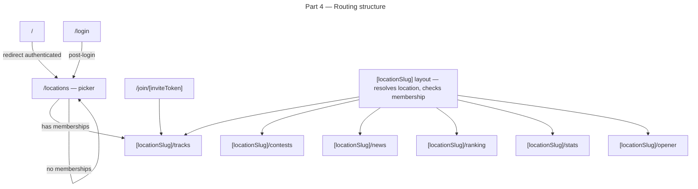

# Instruction: Multi-Location — Part 4: URL Routing Refactor

## Feature

- **Summary**: Move all authenticated routes under `/[locationSlug]/` (e.g. `/dashboard` → `/[slug]/tracks`). Add a `/locations` public picker page for users with no membership. Add a `/join/[inviteToken]` route for hidden location early access. Add redirects from legacy paths. This is the only breaking change in the entire feature — all existing bookmarks will break.
- **Stack**: `Next.js 15`, `TypeScript`, `Auth.js 5`, `Tailwind CSS`
- **Branch name**: `feature/multi-location`
- **Parent Plan**: `2026_04_12-multi-location-master.md`
- **Sequence**: `4 of 6`
- Confidence: 7/10
- Time to implement: ~2.5h

## ⚠️ Production breaking change

All existing URLs change. Pre-deploy requirements:
- Location 1 must have a valid `slug` set in the DB (done in Part 2)
- Deploy must be atomic: new routes + redirects deployed together
- Notify users if needed (bookmarks to `/dashboard` will redirect automatically)

## Existing files

- @middleware.ts
- @app/dashboard/layout.tsx
- @app/contests/layout.tsx
- @app/news/layout.tsx
- @app/ranking/layout.tsx
- @app/stats/layout.tsx
- @app/opener/layout.tsx
- @components/Navbar.tsx
- @components/Drawer.tsx

### New files to create

- `app/locations/page.tsx` — public location picker
- `app/join/[inviteToken]/page.tsx` — invite-based join
- `app/[locationSlug]/layout.tsx` — location context wrapper
- `app/[locationSlug]/tracks/page.tsx` (renamed from `dashboard`)
- `app/[locationSlug]/tracks/track/[trackId]/page.tsx`
- `app/[locationSlug]/tracks/track/[trackId]/edit/page.tsx`
- `app/[locationSlug]/contests/...` (moved)
- `app/[locationSlug]/news/page.tsx` (moved)
- `app/[locationSlug]/ranking/page.tsx` (moved)
- `app/[locationSlug]/stats/page.tsx` (moved)
- `app/[locationSlug]/opener/...` (moved)

## User Journey

## Implementation phases

### Phase 1: Create location layout and context

> The `[locationSlug]` layout resolves the location from the URL and makes it available to all child pages.

1. Create `app/[locationSlug]/layout.tsx`:
   - Call `getLocationBySlug(params.locationSlug)` — 404 if not found
   - If location status is `hidden`, verify user has membership or is super_admin — redirect to `/locations` otherwise
   - Pass `location` to children via a React context provider or as a prop pattern
   - Render `Navbar` with location data
2. Update `middleware.ts`:
   - Protect `/[locationSlug]/*` routes (require auth)
   - Allow `/locations` and `/join/*` for authenticated users
   - Redirect unauthenticated users from all paths to `/login`

### Phase 2: Move existing route folders

> Physically move Next.js route folders under `app/[locationSlug]/`. No logic changes — just relocation.

1. Move `app/dashboard/` → `app/[locationSlug]/tracks/` (rename `dashboard` to `tracks`)
2. Move `app/contests/` → `app/[locationSlug]/contests/`
3. Move `app/news/` → `app/[locationSlug]/news/`
4. Move `app/ranking/` → `app/[locationSlug]/ranking/`
5. Move `app/stats/` → `app/[locationSlug]/stats/`
6. Move `app/opener/` → `app/[locationSlug]/opener/`
7. Update all `import` paths broken by the move

### Phase 3: Add legacy redirects

> Prevent 404s for users with bookmarks to old paths.

1. In `next.config.ts`, add `redirects()`:
   - `/dashboard` → `/locations` (temporary, 307)
   - `/contests` → `/locations` (temporary, 307)
   - `/news` → `/locations` (temporary, 307)
   - `/ranking` → `/locations` (temporary, 307)
   - `/stats` → `/locations` (temporary, 307)
   - `/opener` → `/locations` (temporary, 307)
2. Redirect from `/` for authenticated users → `/locations` (handled in middleware)

### Phase 4: Location picker page

> Page shown after login when user has no membership, or when user wants to join a new location.

1. Create `app/locations/page.tsx`:
   - Fetch all locations with `status = 'published'`
   - Show location cards with name, type, member count
   - "Join" button → calls `joinLocation(locationId)` server action → redirects to `/[slug]/tracks`
   - If user already has memberships, show "Your locations" section at top

### Phase 5: Invite join route

> One-click join for hidden locations via a unique token.

1. Create `app/join/[inviteToken]/page.tsx`:
   - Fetch location by `inviteToken` (super admin creates this)
   - If not found → show error
   - If found → call `joinLocation(locationId)` → redirect to `/[slug]/tracks`
   - Show a confirmation message before redirect

### Phase 6: Post-login redirect logic

> After OAuth login, land user in the right place.

1. In `auth.ts` or post-login page, after session is established:
   - Fetch `getUserLocations(userId)`
   - If no memberships → redirect to `/locations`
   - If has memberships → redirect to `/[lastVisitedSlug]/tracks` (last visited stored in cookie or DB, falls back to first membership)

## Validation flow

1. Run `npm run build` — no TypeScript errors, no missing route references
2. Visit `/dashboard` — redirects to `/locations`
3. Log in as user with no location — lands on `/locations` picker
4. Click "Join" on location 1 — instant membership, redirected to `/default/tracks`
5. Tracks display correctly at `/default/tracks`
6. Visit `/default/contests` — contests display correctly
7. Visit `/default/ranking` — leaderboard displays correctly
8. Visit `/join/[validToken]` — joins hidden location, redirects to its tracks page
9. Visit `/join/[invalidToken]` — shows error page, no crash
10. Log in as existing user with location 1 membership — goes directly to `/default/tracks`
