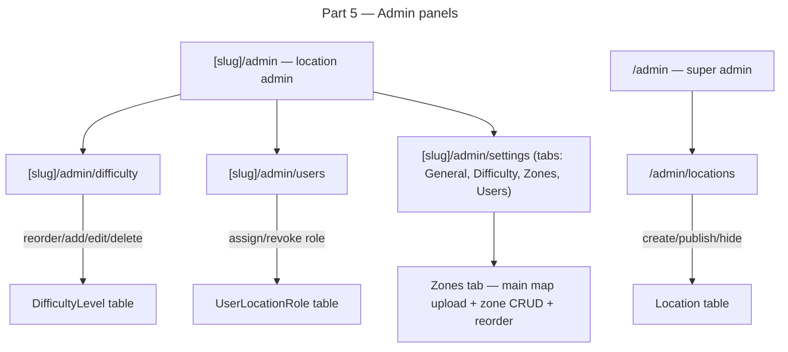

# Instruction: Multi-Location — Part 5: Admin & Difficulty System

## Feature

- **Summary**: Build the location admin panel (difficulty level management, zone configuration, user/role management, location settings) and the super admin panel (create/publish/hide locations). Migrate `Track.level` string field to a foreign key on `DifficultyLevel`. All new pages — no existing routes modified. Zone config tab added to location settings page.
- **Stack**: `Next.js 15`, `TypeScript`, `Prisma 6`, `Tailwind CSS`, `Zod`
- **Branch name**: `feature/multi-location`
- **Parent Plan**: `2026_04_12-multi-location-master.md`
- **Sequence**: `5 of 6`
- Confidence: 8/10
- Time to implement: ~3h

## Production safety

Safe for new pages. The `Track.level` FK migration (Phase 4 of this plan) requires careful ordering: add FK column → backfill → remove string column. The string column removal is the only step that could break old code — do it last, after verifying all code references are gone.

## Existing files

- @prisma/schema.prisma
- @app/[locationSlug]/opener/layout.tsx
- @lib/tracks/actions/searchTrack.ts
- @lib/tracks/actions/postTrack.ts
- @domain/UserRole.enum.ts

### New files to create

- `app/[locationSlug]/admin/page.tsx` — location admin dashboard
- `app/[locationSlug]/admin/difficulty/page.tsx` — difficulty level management
- `app/[locationSlug]/admin/users/page.tsx` — user/role management
- `app/[locationSlug]/admin/settings/page.tsx` — location settings with tabs: General | Difficulty | Zones | Users
- `app/admin/page.tsx` — super admin: platform overview
- `app/admin/locations/page.tsx` — super admin: create/publish/hide locations
- `lib/locations/actions/manageDifficultyLevels.ts`
- `lib/locations/actions/manageLocationUsers.ts`
- `lib/locations/actions/manageLocation.ts`
- `lib/locations/actions/manageZones.ts`
- `components/admin/DifficultyLevelList.tsx` — drag-to-reorder list
- `components/admin/ZoneConfigList.tsx` — drag-to-reorder zone list with image upload
- `components/admin/ZoneDeleteDialog.tsx` — warning dialog + migration zone picker

## User Journey

## Implementation phases

### Phase 1: Location admin routing and guards

> Set up the admin section under `/[locationSlug]/admin/` with proper access control.

1. Create `app/[locationSlug]/admin/layout.tsx` — verify user has `admin` or `super_admin` role for this location via `checkUserLocationRole`, redirect to `/[slug]/tracks` if not authorized
2. Add link to admin panel in `Drawer.tsx` — visible only when `isAdmin` for the current location
3. Create `app/[locationSlug]/admin/page.tsx` — dashboard with links to difficulty, users, settings sub-pages

### Phase 2: Difficulty level management

> Allow location admins to add, rename, reorder, and delete difficulty levels.

1. Create server actions in `manageDifficultyLevels.ts`:
   - `getDifficultyLevels(locationId)` — returns ordered list
   - `createDifficultyLevel(locationId, data)` — adds at end of order
   - `updateDifficultyLevel(id, data)` — rename, color change
   - `reorderDifficultyLevels(locationId, orderedIds)` — receives full ordered array of IDs, updates `order` field
   - `deleteDifficultyLevel(id)` — blocks if tracks reference it (check first, return error)
2. Create `DifficultyLevelList.tsx` component with drag-to-reorder UI (use HTML5 drag or a simple up/down button approach)
3. Create `app/[locationSlug]/admin/difficulty/page.tsx` — renders the list with add/edit/delete controls

### Phase 3: User and role management

> Allow location admins to view members, promote/demote to opener or admin.

1. Create server actions in `manageLocationUsers.ts`:
   - `getLocationMembers(locationId)` — returns all `UserLocation` rows with user info and their `UserLocationRole`
   - `setUserLocationRole(userId, locationId, role | null)` — upsert or delete from `UserLocationRole`
   - `removeUserFromLocation(userId, locationId)` — deletes `UserLocation` row
2. Create `app/[locationSlug]/admin/users/page.tsx` — table of members with role selector and remove button
3. Self-protection: admin cannot demote themselves (check before save)

### Phase 4: Location settings

> Allow admins to update location info and manage the invite token.

1. Create server actions in `manageLocation.ts`:
   - `updateLocationSettings(locationId, data)` — update name, address, website, mapImageUrl
   - `regenerateInviteToken(locationId)` — generates new UUID, saves to `inviteToken`
   - `getInviteLink(locationId)` — returns full URL with token
2. Create `app/[locationSlug]/admin/settings/page.tsx` — form with current location data + invite link section

### Phase 5: Super admin panel

> Global panel for the platform maintainer to create and manage all locations.

1. Create `app/admin/layout.tsx` — verify `isSuperAdmin(session)`, redirect to `/locations` otherwise
2. Create `app/admin/page.tsx` — overview of all locations with status badges
3. Create server actions in `manageLocation.ts`:
   - `createLocation(data)` — creates with `status = 'hidden'` by default
   - `publishLocation(locationId)` — sets `status = 'published'`
   - `hideLocation(locationId)` — sets `status = 'hidden'`
4. Create `app/admin/locations/page.tsx` — list with create form, publish/hide toggles, link to each location's admin

### Phase 6: Zone configuration admin tab

> Allow location admins and super admins to manage zones: name, order, mini-map image, and deletion with track migration. Main map image also managed here.

1. Create server actions in `manageZones.ts`:
   - `getZones(locationId)` — returns ordered `Zone[]`
   - `createZone(locationId, data: { name })` — appends at end of order; enforces max 50 zones per location, returns error if exceeded
   - `updateZone(id, data: { name?, miniMapUrl? })` — rename or update mini-map image URL
   - `reorderZones(locationId, orderedIds: number[])` — receives full ordered array of Zone IDs, updates `order` field for all
   - `getTracksCountByZone(zoneId)` — returns count of tracks assigned to the zone; used to show deletion warning
   - `deleteZone(id, migrateToZoneId: number)` — reassigns all `Track.zoneId` pointing to `id` to `migrateToZoneId`, then deletes the zone; returns error if `migrateToZoneId` is missing and tracks exist
   - Main map image is updated via existing `updateLocationSettings(locationId, { mapImageUrl })` in `manageLocation.ts`
2. Create `ZoneConfigList.tsx` — vertical drag-to-reorder list of zones (same pattern as `DifficultyLevelList.tsx`); each row: zone name (inline editable), mini-map image upload (Cloudinary signature flow), delete button
3. Create `ZoneDeleteDialog.tsx` — shown on delete click when zone has tracks; displays track count warning + dropdown to select migration target zone; deletion blocked until migration zone confirmed
4. Add "Zones" tab to `app/[locationSlug]/admin/settings/page.tsx`:
   - Top section: current main map image display + upload button (Cloudinary, saves to `Location.mapImageUrl`)
   - Below: `ZoneConfigList` with "Add zone" button at bottom
5. Access: guarded by existing `checkUserLocationRole(userId, locationId, 'admin')` layout guard — no extra check needed

### Phase 7: Track.level FK migration

> Migrate Track.level string to a FK on DifficultyLevel. This is a 3-step process to avoid breaking production.

Step A — Add FK column (safe, additive):
1. Verify `difficultyLevelId Int?` already on `Track` in schema (added in Part 1)
2. Column already exists — no migration needed here

Step B — Backfill FK (safe):
1. Write a seed/migration SQL that maps existing `level` string values to `DifficultyLevel.id` for location 1
2. `UPDATE tracks SET "difficultyLevelId" = (SELECT id FROM difficulty_levels WHERE name = tracks.level AND "locationId" = tracks."locationId") WHERE "difficultyLevelId" IS NULL`

Step C — Update code to use FK (safe, deploy before dropping string column):
1. Update `searchTrack.ts` — filter by `difficultyLevelId` instead of `level` string
2. Update `postTrack.ts` — accept `difficultyLevelId`, write to FK field
3. Update all components that display or filter by level — use `DifficultyLevel` relation data
4. Update `getUserStats.ts` — group by `difficultyLevelId` with join to get name

Step D — Drop `level` string column (breaking — last step):
1. Only after all code references to `Track.level` string are removed
2. Run `prisma migrate dev --name remove-track-level-string`
3. Verify `npm run build` passes before deploying

## Validation flow

1. Location admin visits `/[slug]/admin/difficulty` — sees ordered list of 8 difficulty levels
2. Admin reorders levels — order persists on page reload
3. Admin adds a new level — appears at bottom of list
4. Admin visits `/[slug]/admin/users` — sees all members with roles
5. Admin promotes a user to opener — role appears immediately
6. Super admin visits `/admin/locations` — sees all locations
7. Super admin creates a new hidden location — slug auto-generated
8. Super admin publishes it — appears in `/locations` picker
9. New track created with difficulty — uses `difficultyLevelId` FK, displays correct level name
10. Track filters work with new FK-based difficulty levels
11. Location admin visits settings page — sees Zones tab with main map upload and zone list
12. Admin uploads main map — `location.mapImageUrl` updated, image appears in settings
13. Admin adds a zone named "Dalle" — appears in list at bottom
14. Admin reorders zones — order persists on page reload
15. Admin uploads mini-map for a zone — `zone.miniMapUrl` updated
16. Admin tries to delete a zone with tracks — `ZoneDeleteDialog` appears with count and migration picker
17. Admin selects migration zone and confirms — tracks reassigned, zone deleted
