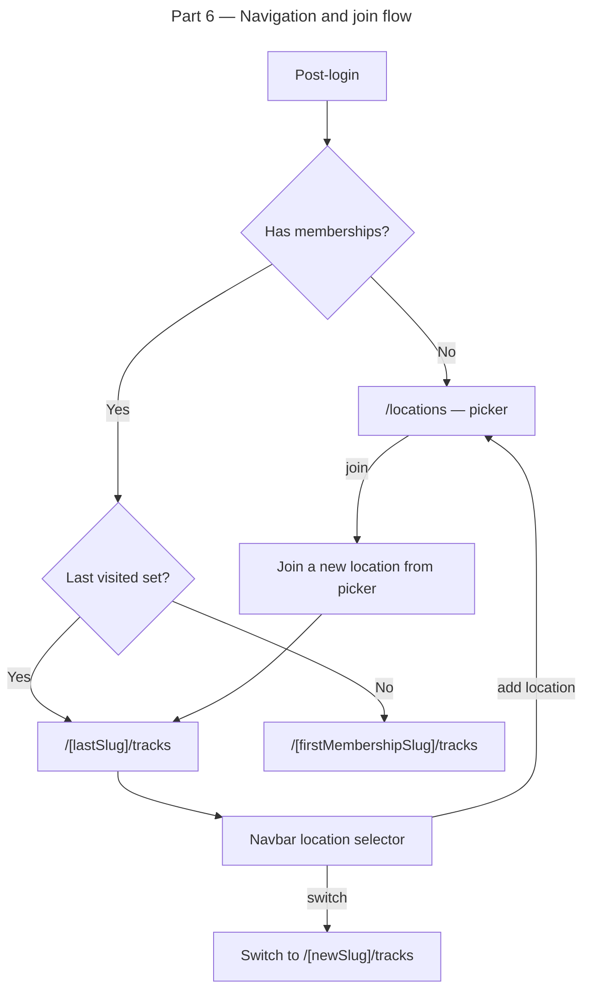

# Instruction: Multi-Location — Part 6: Navigation & UX

## Feature

- **Summary**: Add a location selector to the navbar, persist last visited location per user, implement the post-login redirect flow (picker vs. last visited), build the self-service join UI for public locations, and finalize the Zone UX (update all zone-displaying components to use DB zone data, drop the legacy `Track.zone Int` column). All additive UI work on top of the routing from Part 4, except the final column drop.
- **Stack**: `Next.js 15`, `React`, `TypeScript`, `Tailwind CSS`
- **Branch name**: `feature/multi-location`
- **Parent Plan**: `2026_04_12-multi-location-master.md`
- **Sequence**: `6 of 6`
- Confidence: 8/10
- Time to implement: ~2h

## Production safety

Mostly safe. UI updates are additive. The final step — dropping `Track.zone Int` — is a destructive schema change: run only after verifying all code references to `Track.zone` have been removed and `npm run build` passes cleanly.

## Existing files

- @components/Navbar.tsx
- @components/Drawer.tsx
- @app/[locationSlug]/layout.tsx
- @app/locations/page.tsx
- @lib/locations/actions/getUserLocations.ts

### New files to create

- `components/LocationSelector.tsx` — dropdown in navbar
- `lib/locations/actions/joinLocation.ts` — server action
- `lib/locations/actions/setLastVisitedLocation.ts` — server action
- `hooks/useCurrentLocation.ts` — client hook for current location context (includes zones[])

## User Journey

## Implementation phases

### Phase 1: Last visited location persistence

> Store the last visited location per user so they land there on next login.

1. Create `setLastVisitedLocation(locationId: number)` server action — upserts a `lastVisitedLocationId` on the `UserLocation` row (add field `lastVisitedAt DateTime?` to `UserLocation` in schema, or use a simpler approach: store in a cookie)
2. Preferred approach: store `lastVisitedLocationSlug` in a **cookie** (no schema change, fast) — set on every `[locationSlug]/layout.tsx` render
3. In the post-login redirect (Part 4 Phase 6), read the cookie first → fall back to first membership

### Phase 2: LocationSelector component

> Dropdown in the navbar that lists the user's locations and lets them switch.

1. Create `components/LocationSelector.tsx`:
   - Receives `currentLocation` and `userLocations[]` as props
   - Displays current location name with a chevron
   - Dropdown lists other memberships — click navigates to `/[slug]/tracks`
   - Footer item: "Join another location" → navigates to `/locations`
2. In `app/[locationSlug]/layout.tsx`, fetch `getUserLocations(userId)` and pass to `Navbar`
3. Update `components/Navbar.tsx` to render `LocationSelector` when user is authenticated

### Phase 3: Location picker page polish

> Improve the `/locations` page UI for the self-service join flow.

1. Show location cards with: name, type badge (gym/outdoor), member count, join button
2. "Your locations" section at top if user already has memberships (with "Go" button)
3. Hidden locations never appear in this list (only accessible via invite link)
4. After joining, redirect to `/[slug]/tracks` with a welcome toast

### Phase 4: Join flow server action

> Clean server action for self-service location joining.

1. Create `joinLocation(locationId: number)` server action:
   - Verify location exists and is `published` (or super_admin bypasses)
   - Upsert `UserLocation` row — idempotent if already member
   - Return `{ slug }` for redirect
2. Reuse this action from both `/locations` picker and `/join/[inviteToken]` page (Part 4 already calls it — verify)

### Phase 5: Zone UX finalization

> Switch all zone-displaying and zone-selecting UI from the raw `Track.zone Int` to the `Zone` entity from DB. Drop the legacy column at the end.

1. Update `Track.schema.ts` — add `zoneRef: { id, name, miniMapUrl: string | null }.optional()` alongside existing `zone: z.number()` (kept until column drop)
2. Update `Zone.tsx` — accept `miniMapUrl: string | null` prop; render Cloudinary URL if set, transparent placeholder if null; remove path construction from zone number
3. Update `TrackCard.tsx`, `AddTrackCard.tsx`, `TrackDetails.tsx` — pass `track.zoneRef.miniMapUrl` and `track.zoneRef.name` to `Zone`; show zone name as a text label (replaces the implicit "Zone N" from the number)
4. Update `ZoneFilter.tsx` — receive `zones: { id: number, name: string }[]` as prop; replace hardcoded 10-item generation with prop; display zone name in labels
5. Update `TrackList.tsx` — receive `zones` from location context and pass to `ZoneFilter`
6. Update `TrackForm.tsx` — zone picker reads location zones (id + name) from props/context; default to first available zone; `Zone` preview uses `miniMapUrl`
7. Update `app/[locationSlug]/tracks/page.tsx` — remove static `room-map.png` import; read `location.mapImageUrl` from location context; render main map image only if `mapImageUrl` is set (graceful absence)
8. Verify no remaining code references to `Track.zone` (the integer field): run `grep -r "track\.zone\b" --include="*.ts" --include="*.tsx"` — must return nothing in app source
9. Remove `zone Int` from `Track` in `schema.prisma`; remove `?` from `zoneId Int?` making it `zoneId Int` (NOT NULL); run `prisma migrate dev --name finalize-track-zone-fk`
10. Remove old `zone: z.number()` from `Track.schema.ts`; rename `zoneRef` relation in schema to `zone` (cosmetic rename, no SQL migration)

### Phase 6: Drawer navigation update

> Ensure the drawer links respect the current location slug.

1. Update `components/Drawer.tsx` — all navigation links use the current `locationSlug` from context:
   - Tracks → `/[slug]/tracks`
   - News → `/[slug]/news`
   - Stats → `/[slug]/stats`
   - Ranking → `/[slug]/ranking`
   - Contests → `/[slug]/contests`
2. Back button logic — update `lastTrackListUrl` localStorage key to include slug prefix
3. Add "Admin" link to drawer when user has admin role at current location
4. Add "Platform Admin" link when `isSuperAdmin`

## Validation flow

1. Log in as existing user with location 1 membership — lands on `/default/tracks` (last visited or first)
2. Open navbar — location selector shows "Default" as current location
3. Join a second location via `/locations` — selector now shows both, can switch between them
4. Switch to location 2 — URL changes to `/[slug2]/tracks`, tracks filtered to location 2
5. Log out and log back in — lands on the last visited location (cookie persists)
6. Log in as new user with no membership — lands on `/locations` picker, joins location 1, redirected to `/default/tracks`
7. Open drawer — all links point to `/default/...`
8. Drawer shows "Admin" link when user has admin role at current location
9. TrackCard shows zone name (e.g. "Zone 1") and mini-map image (placeholder if not uploaded yet)
10. ZoneFilter dropdown shows zone names from DB — not "Zone 1...10" hardcoded
11. Dashboard main map renders from `location.mapImageUrl` (placeholder/absent if not set)
12. Track form zone picker lists location's zones by name
13. Verify `Track.zone` column no longer exists in DB after column drop migration
14. Run `npm run build` — no TypeScript errors after column drop and schema cleanup
