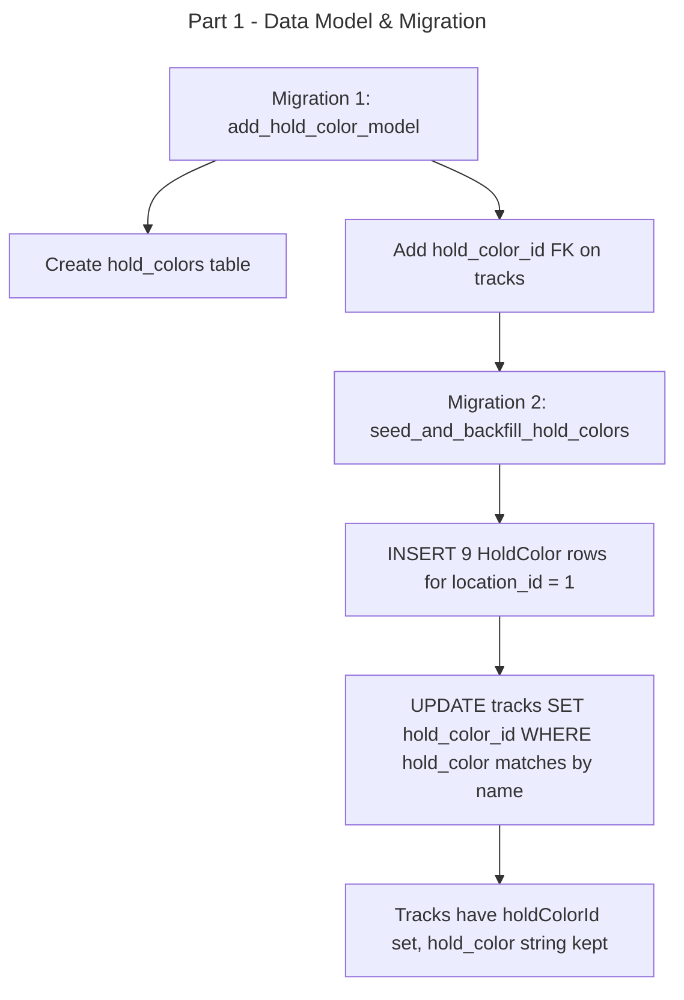

# Instruction: Configurable Hold Colors — Part 1: Data Model & Migration

## Feature

- **Summary**: Add HoldColor Prisma model, add nullable holdColorId FK to Track, generate schema migration, then apply a second data migration that inserts 9 colors for location 1 and backfills holdColorId on existing tracks
- **Stack**: `Next.js 15, Prisma ORM 6, PostgreSQL`
- **Branch name**: `feature/configurable-hold-colors`
- **Parent Plan**: `./2026_04_23-configurable-hold-colors-master.md`
- **Sequence**: `1 of 3`
- Confidence: 9/10
- Time to implement: ~1h

## Existing files

- @prisma/schema.prisma

### New files to create

- `prisma/migrations/<timestamp>_add_hold_color_model/migration.sql` (auto-generated by prisma)
- `prisma/migrations/<timestamp>_seed_and_backfill_hold_colors/migration.sql` (manually written SQL)

## User Journey

## Implementation phases

### Phase 1 — Prisma schema

> Add HoldColor model and FK on Track

1. Add `HoldColor` model to `prisma/schema.prisma`:
   - `id Int @id @default(autoincrement())`
   - `locationId Int @map("location_id")` → relation to Location
   - `name String`
   - `color String` (hex, e.g. `#22C55E`)
   - `order Int`
   - `@@unique([locationId, order])`
   - `@@map("hold_colors")`
   - Relation back to `Track[]`
2. Add to `Track` model:
   - `holdColorId Int? @map("hold_color_id")`
   - `holdColor HoldColor? @relation(fields: [holdColorId], references: [id])`
   - Keep existing `holdColor String?` field as `holdColorLegacy String? @map("hold_color")` — rename only in Prisma alias, no DB column rename
3. Add inverse relation on `Location` model: `holdColors HoldColor[]`

### Phase 2 — Migration

> Generate and apply Prisma migration

1. Run `npx prisma migrate dev --name add_hold_color_model`
2. Verify migration SQL: new `hold_colors` table, `hold_color_id` nullable FK on `tracks`

### Phase 3 — Data migration

> Insert 9 colors and backfill holdColorId in a second manual migration

1. Create `prisma/migrations/<timestamp>_seed_and_backfill_hold_colors/migration.sql` manually (use `prisma migrate dev --create-only` then edit the SQL before applying)
2. SQL block 1 — INSERT 9 rows into `hold_colors` for `location_id = 1` (use `INSERT ... ON CONFLICT DO NOTHING` for idempotency):
   - order 1 Green `#22C55E`, 2 Red `#EF4444`, 3 Blue `#3B82F6`, 4 Yellow `#EAB308`, 5 White `#F9FAFB`, 6 Black `#111827`, 7 Orange `#F97316`, 8 Pink `#EC4899`, 9 Purple `#A855F7`
3. SQL block 2 — UPDATE `tracks` SET `hold_color_id = hc.id` FROM `hold_colors hc` WHERE `LOWER(tracks.hold_color) = LOWER(hc.name)` AND `hc.location_id = tracks.location_id`
4. Tracks with no match (e.g. `Unknown`, NULL) keep `hold_color_id = NULL` — no action needed
5. Apply with `npx prisma migrate dev`

## Validation flow

1. Run `npx prisma migrate dev` — confirm both migrations applied, no errors
2. Query `SELECT * FROM hold_colors WHERE location_id = 1 ORDER BY "order"` — confirm 9 rows
3. Query `SELECT id, hold_color, hold_color_id FROM tracks LIMIT 20` — confirm backfill applied
4. Tracks with `hold_color = 'Unknown'` or NULL should have `hold_color_id = NULL`
