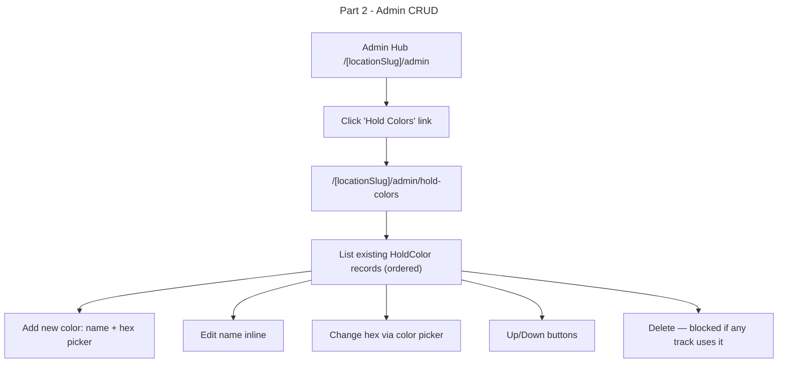

# Instruction: Configurable Hold Colors — Part 2: Admin CRUD

## Feature

- **Summary**: Add /[locationSlug]/admin/hold-colors page with full CRUD (create, rename, recolor, reorder, delete-blocked-if-used), wired to admin nav
- **Stack**: `Next.js 15 (App Router), React, Prisma ORM 6, Zod, Tailwind CSS`
- **Branch name**: `feature/configurable-hold-colors`
- **Parent Plan**: `./2026_04_23-configurable-hold-colors-master.md`
- **Sequence**: `2 of 3`
- Confidence: 9/10
- Time to implement: ~1h

## Existing files

- @app/[locationSlug]/admin/page.tsx
- @app/[locationSlug]/admin/difficulty/page.tsx
- @components/admin/DifficultyLevelList.tsx
- @lib/locations/actions/manageDifficultyLevels.ts

### New files to create

- `app/[locationSlug]/admin/hold-colors/page.tsx`
- `components/admin/HoldColorList.tsx`
- `lib/locations/actions/manageHoldColors.ts`

## User Journey

## Implementation phases

### Phase 1 — Server actions

> Mirror manageDifficultyLevels.ts pattern exactly

1. Create `lib/locations/actions/manageHoldColors.ts` with:
   - `getHoldColors(locationId)` — ordered by `order` asc
   - `createHoldColor(locationId, data: { name, color, order })` — auth check (admin), append at end
   - `updateHoldColor(id, data: { name?, color? })` — auth check
   - `deleteHoldColor(id)` — auth check, hard block if any Track references it (throw user-facing error)
   - `reorderHoldColors(locationId, orderedIds: number[])` — transaction, reassign order 1..N

### Phase 2 — Admin page

> Server component fetching data, client component for CRUD

1. Create `app/[locationSlug]/admin/hold-colors/page.tsx` — server component, fetch location + hold colors, render `<HoldColorList>`
2. Create `components/admin/HoldColorList.tsx` — client component, mirror `DifficultyLevelList.tsx`:
   - List rows: color swatch (hex preview), name input, hex color picker, ↑↓ buttons, delete button
   - Add new row at bottom
   - Inline save on blur / reorder on click
   - Show error toast if delete blocked

### Phase 3 — Admin nav

> Add entry in admin hub

1. In `app/[locationSlug]/admin/page.tsx`, add "Hold Colors" link card pointing to `/[locationSlug]/admin/hold-colors`, positioned alongside "Difficulty Levels"

## Validation flow

1. Go to `/{locationSlug}/admin` — confirm "Hold Colors" link visible
2. Click through — confirm 9 seeded colors listed
3. Create a new color — confirm it appears
4. Rename and recolor — confirm changes persist
5. Reorder with ↑↓ — confirm new order saved
6. Attempt delete on a color used by a track — confirm error toast, no deletion
7. Delete an unused color — confirm removed
