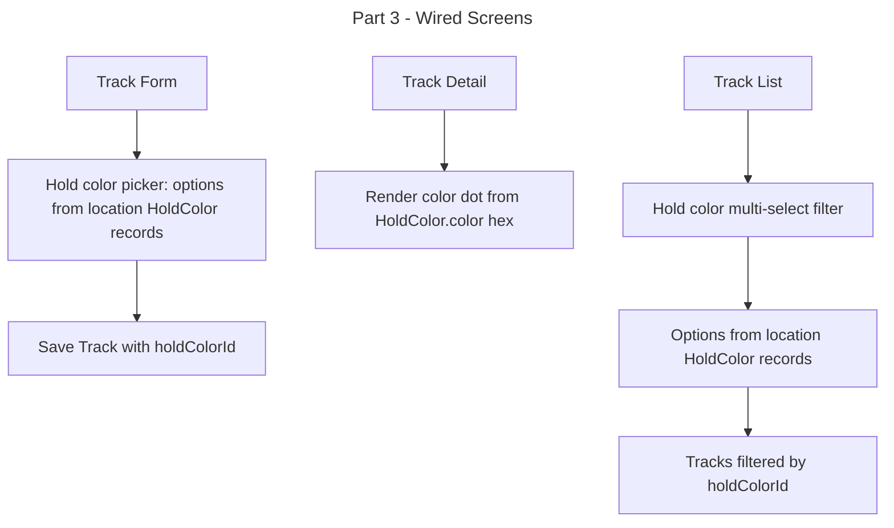

# Instruction: Configurable Hold Colors — Part 3: Wired Screens & Cleanup

## Feature

- **Summary**: Replace all hardcoded holdColor string/enum logic with holdColorId FK in form, detail, filter, search actions; remove HoldColorEnum and dead utility code
- **Stack**: `Next.js 15 (App Router), React, Prisma ORM 6, Zod, react-select, Tailwind CSS`
- **Branch name**: `feature/configurable-hold-colors`
- **Parent Plan**: `./2026_04_23-configurable-hold-colors-master.md`
- **Sequence**: `3 of 3`
- Confidence: 9/10
- Time to implement: ~1h

## Existing files

- @domain/HoldColor.enum.ts
- @domain/Track.schema.ts
- @domain/Filters.ts
- @components/tracks/TrackForm.tsx
- @components/tracks/TrackDetails.tsx
- @components/tracks/TrackList.tsx
- @components/filters/HoldColorFilter.tsx
- @lib/tracks/actions/postTrack.ts
- @lib/tracks/actions/searchTrack.ts
- @lib/tracks/actions/searchContestTrack.ts
- @utils/hold.utils.ts
- @utils/color.utils.ts

### New files to create

- none

## User Journey

## Implementation phases

### Phase 1 — Domain layer

> Update Zod schemas and filter types

1. In `domain/Track.schema.ts`: replace `holdColor` (HoldColorEnum) with `holdColorId Int? nullable`
2. In `domain/Filters.ts`: replace `holdColor?: string` with `holdColorIds?: number[]`

### Phase 2 — Server actions

> Update search and post actions to use holdColorId

1. In `lib/tracks/actions/postTrack.ts`: read `holdColorId` from FormData (parseInt), replace `holdColor` string write
2. In `lib/tracks/actions/searchTrack.ts`: filter by `holdColorId: { in: holdColorIds }` when filter present
3. In `lib/tracks/actions/searchContestTrack.ts`: same filter change as searchTrack

### Phase 3 — Track form

> Replace string select with holdColorId select fed from DB

1. `TrackForm.tsx` must receive `holdColors: HoldColor[]` prop (id, name, color)
2. Replace `holdColorOptions` from HoldColorEnum with mapped `holdColors` prop
3. Update `classNames` on the Select: replace `holdColorCustomSelectClass` with dynamic per-option color dot using `option.color` hex (inline style on the dot, no hardcoded mapping)
4. Field name in form: `holdColorId` (integer)
5. Update callers of TrackForm to pass `holdColors` fetched from `getHoldColors(locationId)`

### Phase 4 — Track detail

> Render hex color from related HoldColor record

1. In `TrackDetails.tsx`: replace `getBgColor(track.holdColor)` with inline style `backgroundColor: track.holdColor?.color` (use related `holdColor` object from Prisma include)
2. Ensure Prisma query that fetches track for detail page includes `holdColor: { select: { name, color } }`

### Phase 5 — Hold color filter

> Migrate to multi-select fed from DB

1. In `HoldColorFilter.tsx`: change prop to `holdColors: HoldColor[]` + `selectedIds: number[]`
2. Options mapped from `holdColors` with hex dot (same pattern as DifficultyFilter)
3. `isMulti={true}`, `isClearable`
4. In `TrackList.tsx`: update state from `selectedHoldColor: string` to `selectedHoldColorIds: number[]`
5. Pass `holdColors` fetched at page level down to filter and form

### Phase 6 — Cleanup

> Remove dead code once all consumers updated

1. Delete `domain/HoldColor.enum.ts`
2. In `utils/color.utils.ts`: remove `getBgColor`, `getBorderColor`, `getSelectColor` holdColor string mapping functions (verify no other callers)
3. In `utils/hold.utils.ts`: remove `holdColorCustomSelectClass` if no longer used (verify no other callers)

## Validation flow

1. Open track form — hold color picker shows location's colors with hex dots, no hardcoded enum
2. Create a track with a color — saved with holdColorId
3. Open track detail — color dot matches HoldColor.color hex
4. Open track list advanced filters — hold color multi-select shows location's colors
5. Select 2 colors in filter — track list filtered correctly
6. Confirm `domain/HoldColor.enum.ts` deleted, no TypeScript errors
