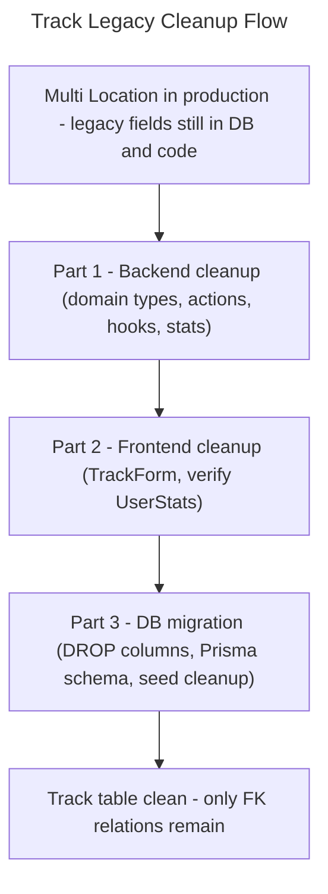

# Master Plan: Track Legacy Fields Cleanup

## Overview

- **Goal**: Remove deprecated `level`, `zone`, and `holdColorLegacy` columns from the Track table and all their code dependencies now that Multi Location is in production
- **Risk Score**: 11/13
- **Branch**: `refactor/track-legacy-cleanup`

## User Journey

## Child Plans

| #   | Plan              | File                                        | Status  | Validated |
| --- | ----------------- | ------------------------------------------- | ------- | --------- |
| 1   | Backend cleanup   | `./2026_04_23-track-legacy-fields-cleanup-part-1.md` | pending | [ ]       |
| 2   | Frontend cleanup  | `./2026_04_23-track-legacy-fields-cleanup-part-2.md` | blocked | [ ]       |
| 3   | DB migration      | `./2026_04_23-track-legacy-fields-cleanup-part-3.md` | blocked | [ ]       |

## Validation Protocol

1. Complete Part 1, verify no TypeScript errors, no references to `track.level` or `track.zone` in backend
2. [ ] Checkpoint 1: User confirms Part 1 — unblocks Part 2
3. Complete Part 2, verify TrackForm still submits correctly
4. [ ] Checkpoint 2: User confirms Part 2 — unblocks Part 3
5. ⚠️ Part 3 is DESTRUCTIVE — explicitly confirm target environment before running migration
6. Complete Part 3, run migration on dev branch first, then production
7. [ ] Final: App functional, track create/edit/stats work end-to-end

## Estimations

- **Confidence**: 9/10
- **Duration**: ~3h total (1h + 30min + 1h30)
