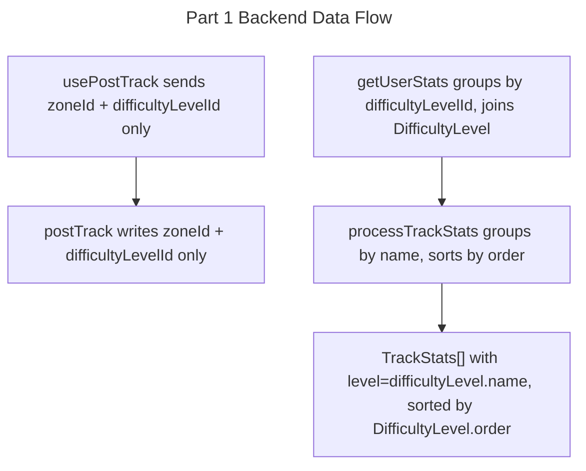

# Instruction: Track Legacy Fields Cleanup — Part 1: Backend

## Feature

- **Summary**: Remove all backend references to `Track.level`, `Track.zone`, and `Track.holdColorLegacy`. Rewrite stats pipeline to group by `difficultyLevelId` + `DifficultyLevel.order` instead of the raw `level` string.
- **Stack**: `Next.js 15, Prisma 6, TypeScript, Zod`
- **Branch name**: `refactor/track-legacy-cleanup`
- **Parent Plan**: `./2026_04_23-track-legacy-fields-cleanup-master.md`
- **Sequence**: `1 of 3`
- Confidence: 9/10
- Time to implement: ~1h

## Existing files

- @domain/Track.schema.ts
- @domain/Difficulty.enum.ts
- @lib/tracks/actions/postTrack.ts
- @lib/tracks/hooks/usePostTrack.ts
- @lib/stats/actions/getUserStats.ts
- @lib/stats/actions/userStatsProcessor.ts

### New file to create

- none

## User Journey

## Implementation phases

### Phase 1 — Domain schema cleanup

> Remove deprecated fields from the Zod Track schema

1. In `domain/Track.schema.ts`: remove `level: DifficultyEnum.catch('Unknown')` (line 24) and `zone: z.number()` (line 25)
2. Remove the `DifficultyEnum` import since it will no longer be used here
3. Check if `DifficultyEnum` / `difficultyOrder` are used anywhere else — if only in `userStatsProcessor.ts`, they will be removed in Phase 3

### Phase 2 — postTrack server action

> Stop writing deprecated columns

1. In `postTrack.ts`: remove `const zone = parseIntOrThrow(...)` (line 25) and `const level = 'Unknown'` (line 34)
2. Remove `zone` and `level` from both the `update` block (lines 50, 52) and the `create` block (lines 62–63)
3. Remove `level` and `zone` from `logger.start` and `logger.success` calls (lines 38–39, 73)

### Phase 3 — usePostTrack hook

> Stop sending deprecated FormData fields

1. In `usePostTrack.ts`: remove `formData.append('level', track.level)` (line 24) and `formData.append('zone', track.zone.toString())` (line 25)
2. Simplify line 26 from `(track.zoneId ?? track.zone).toString()` to `track.zoneId?.toString() ?? ''`

### Phase 4 — Stats pipeline rewrite

> Migrate from groupBy level string to groupBy difficultyLevelId + DifficultyLevel.order sort

In `getUserStats.ts`:
1. Change `userTrackProgress` select to include `difficultyLevel: { select: { name, color, order } }` instead of `level`
2. Replace `prisma.track.groupBy({ by: ['level'] })` with `prisma.track.groupBy({ by: ['difficultyLevelId'], _count: { _all: true } })`
3. After groupBy, fetch matching DifficultyLevels: `prisma.difficultyLevel.findMany({ where: { id: { in: [...ids] } } })`
4. Remove the separate `difficultyLevels` query (lines 45–51) and `colorMap` — colors now come from the join
5. Pass merged data (DifficultyLevel metadata + count) to `processTrackStats`

In `userStatsProcessor.ts`:
1. Update function signature: replace `{ level: string }[]` inputs with `{ difficultyLevel: { name, color, order } | null }[]`
2. Remove `colorMap` parameter
3. Group stats by `difficultyLevel.name` (tracks with `null` difficultyLevel go to an "Unknown" bucket)
4. Replace `sortTrackStatsByDifficulty` (which uses `difficultyOrder.indexOf`) with sort by `difficultyLevel.order` ascending
5. Remove `import { difficultyOrder }` — no longer needed
6. Keep `TrackStats.level` populated with `difficultyLevel.name` so `UserStats.tsx` requires no changes

### Phase 5 — Cleanup Difficulty enum

> Remove unused exports

1. In `domain/Difficulty.enum.ts`: remove `difficultyOrder` export (replaced by DB `order` field)
2. Check if `DifficultyEnum` is still imported anywhere — if not, remove the entire file; if yes, keep it

## Validation flow

1. Run `tsc --noEmit` — zero TypeScript errors
2. Grep for `track\.level` and `track\.zone` in `lib/` and `domain/` — no matches
3. Grep for `formData.append('level'` and `formData.append('zone'` — no matches
4. Manually test: open the app, navigate to user stats — stats still render correctly
5. Manually test: create/edit a track — no server error, track saved with correct `zoneId` and `difficultyLevelId`
