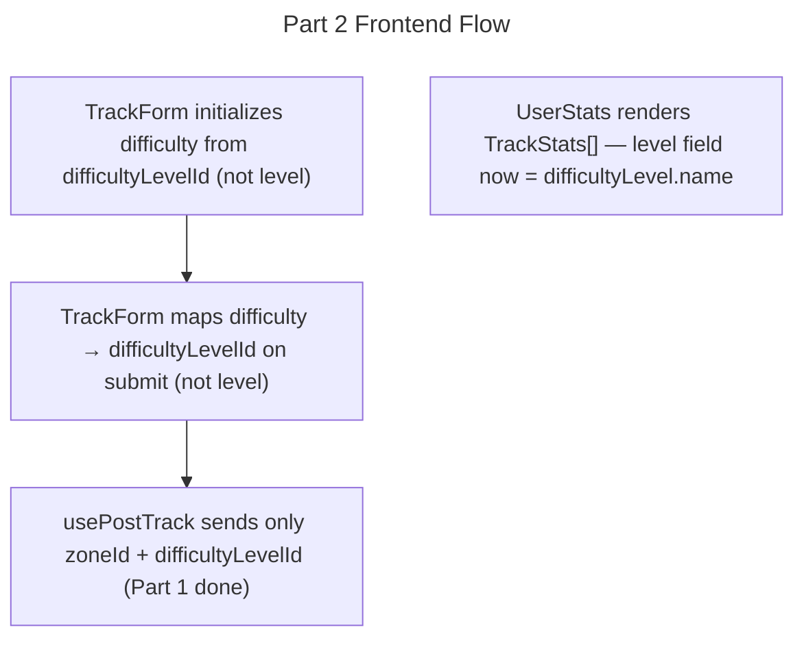

# Instruction: Track Legacy Fields Cleanup — Part 2: Frontend

## Feature

- **Summary**: Update `TrackForm` to write `difficultyLevelId` instead of `level`, use `zoneId` exclusively (remove `zone` raw usage), and verify `UserStats` still renders correctly after the stats pipeline change from Part 1.
- **Stack**: `Next.js 15, React, TypeScript`
- **Branch name**: `refactor/track-legacy-cleanup`
- **Parent Plan**: `./2026_04_23-track-legacy-fields-cleanup-master.md`
- **Sequence**: `2 of 3`
- Confidence: 9/10
- Time to implement: ~30min

## Existing files

- @components/tracks/TrackForm.tsx

### New file to create

- none

## User Journey

## Implementation phases

### Phase 1 — TrackForm difficulty field

> Map form `difficulty` to `difficultyLevelId` instead of `level`

1. In `TrackForm.tsx`: change initial state from `difficulty: initialTrack?.level || ''` to `difficulty: initialTrack?.difficultyLevelId?.toString() || ''`
2. Change the sync from `initialTrack.level` to `initialTrack.difficultyLevelId?.toString() ?? ''`
3. Change the form → track mapping: instead of writing `level: form.difficulty`, write `difficultyLevelId: form.difficulty ? parseInt(form.difficulty) : undefined`
4. Ensure the difficulty dropdown is already bound to DifficultyLevel IDs (verify — the form likely uses `difficultyLevel.id` as option values already, if not, update accordingly)

### Phase 2 — TrackForm zone field

> Remove raw `zone` usage, use `zoneId` exclusively

1. Remove any references to `track.zone` used as raw int — replace with `track.zoneId`
2. Ensure zone dropdown value is bound to `zoneId` (FK to Zone model), not the raw int

### Phase 3 — UserStats verification

> Confirm no changes needed after stats pipeline rewrite

1. Verify `UserStats.tsx` only uses `TrackStats` fields: `level`, `color`, `mountedDone`, `totalDone`, `totalMounted`
2. Confirm `level` in `TrackStats` is now populated with `difficultyLevel.name` from the processor — no interface change needed

## Validation flow

1. Run `tsc --noEmit` — zero TypeScript errors
2. Open track create form: select a zone (via ZoneId) and a difficulty (via DifficultyLevelId) — form submits without error
3. Edit an existing track: verify difficulty and zone pre-populate correctly from `difficultyLevelId` and `zoneId`
4. Open user stats page: stats render correctly with correct difficulty names and colors
