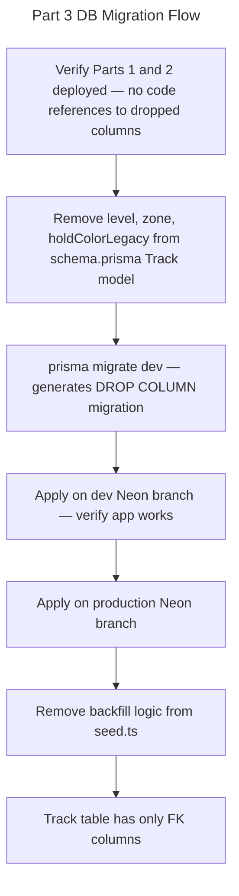

# Instruction: Track Legacy Fields Cleanup — Part 3: DB Migration

## Feature

- **Summary**: Remove `level`, `zone`, and `holdColorLegacy` (DB: `holdColor`) from the Prisma schema and generate a migration to DROP these columns from the Track table. Also remove the backfill seed logic. **BLOCKED until Parts 1 and 2 are validated.**
- **Stack**: `Prisma 6, PostgreSQL (Neon)`
- **Branch name**: `refactor/track-legacy-cleanup`
- **Parent Plan**: `./2026_04_23-track-legacy-fields-cleanup-master.md`
- **Sequence**: `3 of 3`
- Confidence: 9/10
- Time to implement: ~1h30 (includes cautious env verification)

## Existing files

- @prisma/schema.prisma
- @prisma/seed.ts

### New file to create

- `prisma/migrations/<timestamp>_drop_track_legacy_fields/migration.sql` (generated by Prisma)

## User Journey



## Implementation phases

### Phase 1 — Prisma schema update

> Remove deprecated fields from the Track model

1. In `prisma/schema.prisma`, remove from the `Track` model:
   - `zone Int` (line 87)
   - `level String?` (line 89)
   - `holdColorLegacy String? @default("Unknown") @map(name: "holdColor")` (line 91)
2. Verify no other model or relation references these removed fields

### Phase 2 — Generate migration

> ⚠️ DESTRUCTIVE — columns will be permanently dropped

1. **Verify** which `DATABASE_URL` is active: must point to the **dev** Neon branch, NOT production
2. Run `npx prisma migrate dev --name drop_track_legacy_fields`
3. Inspect the generated `migration.sql` — confirm it contains exactly:
   ```sql
   ALTER TABLE "Track" DROP COLUMN "level";
   ALTER TABLE "Track" DROP COLUMN "zone";
   ALTER TABLE "Track" DROP COLUMN "holdColor";
   ```
   No other DROP statements should be present
4. If the generated SQL looks correct, apply it to dev and run the app end-to-end

### Phase 3 — Production migration

> ⚠️ IRREVERSIBLE — confirm with user before this step

1. Switch `DATABASE_URL` to point to production Neon branch
2. Run `npx prisma migrate deploy`
3. Verify migration applied cleanly — check Prisma migration history table

### Phase 4 — Seed cleanup

> Remove backfill logic that is no longer needed

1. In `prisma/seed.ts`: remove the block that backfills `zoneId` from `zone` (approximately lines 62–78)
2. Seeds must remain additive-only — no deletions

## Validation flow

1. `npx prisma validate` — schema is valid
2. After dev migration: `tsc --noEmit` — no errors related to removed fields
3. Create a new track on dev — no DB error about missing `zone` or `level` columns
4. Run user stats on dev — stats still render
5. After production migration: same smoke tests on production app
